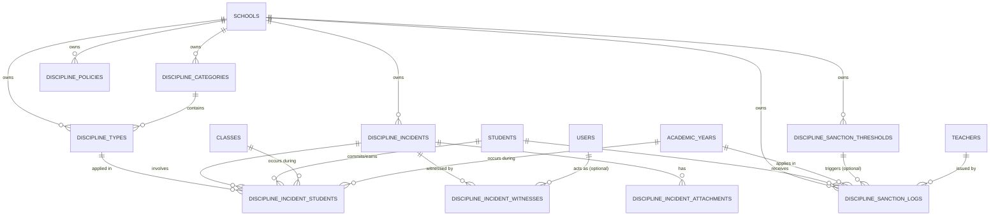

# 02 — Database

> Source: `guruhub-api/src/schema/`, `migrations/`, `drizzle.config.ts`
> Cross-ref: [01_System_Architecture](01_System_Architecture.md) | [05_MultiTenant](05_MultiTenant.md) | [06_Modules](06_Modules.md)

---

## Engine & ORM

- **Database:** MySQL 8.4 (production: MariaDB compatible)
- **ORM:** Drizzle ORM ^0.45.2
- **Migration tool:** Drizzle Kit (`bunx drizzle-kit migrate`)
- **Migration files:** `guruhub-api/migrations/` — 8 files (0000–0007)
- **Schema files:** `guruhub-api/src/schema/` — one file per entity

---

## Multi-Tenant Model

**Shared Database, Shared Schema.** All schools share one database. Every tenant-scoped table has a `school_id BIGINT UNSIGNED NOT NULL` column. All queries always include `WHERE school_id = ?`.

---

## Complete Table Reference

### `schools` — Tenant Root
```
id           SERIAL PK
npsn         VARCHAR(8) UNIQUE NOT NULL     -- 8-digit national school ID
name         VARCHAR(255) NOT NULL
level        ENUM('SMP','SMA') NOT NULL
address      TEXT
phone        VARCHAR(20)
status       ENUM('Negeri','Swasta') NOT NULL
created_at   TIMESTAMP
updated_at   TIMESTAMP
```
No `school_id` on this table — this IS the tenant.

---

### `users`
```
id            SERIAL PK
school_id     BIGINT UNSIGNED NOT NULL FK→schools
email         VARCHAR(255) NOT NULL
password_hash VARCHAR(255) NOT NULL
role          ENUM('SuperAdmin','SchoolAdmin','Principal','Teacher','HomeroomTeacher','Student')
status        ENUM('Aktif','Nonaktif') DEFAULT 'Aktif'
created_at    TIMESTAMP
updated_at    TIMESTAMP

UNIQUE: uq_school_email (school_id, email)
```

---

### `sessions`
```
id          SERIAL PK
school_id   BIGINT UNSIGNED NOT NULL FK→schools
user_id     BIGINT UNSIGNED NOT NULL FK→users
token_id    VARCHAR(36) NOT NULL          -- UUID of refresh token
user_agent  VARCHAR(255)
ip_address  VARCHAR(45)
is_revoked  BOOLEAN DEFAULT false
expires_at  TIMESTAMP NOT NULL
created_at  TIMESTAMP
updated_at  TIMESTAMP
```

---

### `audit_logs`
```
id          SERIAL PK
school_id   BIGINT UNSIGNED FK→schools (nullable — global admin actions)
user_id     BIGINT UNSIGNED FK→users (nullable)
action      VARCHAR(100) NOT NULL         -- e.g. 'LOGIN', 'LOGOUT'
table_name  VARCHAR(100) NOT NULL
record_id   BIGINT UNSIGNED
old_values  JSON
new_values  JSON
ip_address  VARCHAR(45)
created_at  TIMESTAMP
```

---

### `academic_years`
```
id          SERIAL PK
school_id   BIGINT UNSIGNED NOT NULL FK→schools
year        VARCHAR(9) NOT NULL           -- e.g. '2025/2026'
semester    ENUM('Ganjil','Genap') NOT NULL
is_active   BOOLEAN DEFAULT false
created_at  TIMESTAMP
updated_at  TIMESTAMP

UNIQUE: uq_school_academic_semester (school_id, year, semester)
```
⚠️ Semester here uses `'Ganjil'/'Genap'` (Title Case). `report_cards.semester` uses `'GANJIL'/'GENAP'` (UPPER). Known inconsistency.

---

### `teachers`
```
id          SERIAL PK
school_id   BIGINT UNSIGNED NOT NULL FK→schools
user_id     BIGINT UNSIGNED FK→users ON DELETE SET NULL (nullable)
nip         VARCHAR(18)                   -- nullable: contract teachers (honorer)
name        VARCHAR(255) NOT NULL
phone       VARCHAR(20)
gender      ENUM('L','P') NOT NULL
deleted_at  TIMESTAMP                     -- soft delete
created_at  TIMESTAMP
updated_at  TIMESTAMP

UNIQUE: uq_school_nip (school_id, nip)
```

---

### `students`
```
id          SERIAL PK
school_id   BIGINT UNSIGNED NOT NULL FK→schools
user_id     BIGINT UNSIGNED FK→users ON DELETE SET NULL (nullable)
nisn        VARCHAR(20) UNIQUE            -- NULL on soft-delete (prevents constraint conflict)
name        VARCHAR(255) NOT NULL
gender      ENUM('L','P') NOT NULL
religion    ENUM('Islam','Kristen','Katolik','Hindu','Buddha','Khonghucu') DEFAULT 'Islam'
status      ENUM('Aktif','Nonaktif') DEFAULT 'Aktif'
deleted_at  TIMESTAMP                     -- soft delete
created_at  TIMESTAMP
updated_at  TIMESTAMP
```
`nisn` is globally unique (no `school_id` scoping). Nullified on soft-delete per migration 0005/fix-nisn-softdelete.sql.

---

### `subjects`
```
id          SERIAL PK
school_id   BIGINT UNSIGNED NOT NULL FK→schools
name        VARCHAR(100) NOT NULL
code        VARCHAR(20) NOT NULL          -- e.g. 'IND-SMP7'
grade_level ENUM('7','8','9','10','11','12') NOT NULL
description VARCHAR(255)
status      ENUM('Aktif','Nonaktif') DEFAULT 'Aktif'
deleted_at  TIMESTAMP
created_at  TIMESTAMP
updated_at  TIMESTAMP

UNIQUE: uq_school_subject_code (school_id, code, deleted_at)
UNIQUE: uq_school_subject_name_grade (school_id, name, grade_level, deleted_at)
```

---

### `subject_teachers`
```
id          SERIAL PK
school_id   BIGINT UNSIGNED NOT NULL FK→schools
class_id    BIGINT UNSIGNED NOT NULL FK→classes
subject_id  BIGINT UNSIGNED NOT NULL FK→subjects
teacher_id  BIGINT UNSIGNED NOT NULL FK→teachers

UNIQUE: uq_school_class_subject (school_id, class_id, subject_id)
```
No soft-delete. Assignment is hard-replaced.

---

### `classes`
```
id                   SERIAL PK
school_id            BIGINT UNSIGNED NOT NULL FK→schools
academic_year_id     BIGINT UNSIGNED NOT NULL FK→academic_years
homeroom_teacher_id  BIGINT UNSIGNED FK→teachers ON DELETE SET NULL
name                 VARCHAR(50) NOT NULL      -- e.g. 'VII-A'
grade_level          ENUM('7','8','9','10','11','12') NOT NULL
status               ENUM('Aktif','Nonaktif') DEFAULT 'Aktif'
deleted_at           TIMESTAMP
created_at           TIMESTAMP
updated_at           TIMESTAMP

UNIQUE: uq_school_year_class_name (school_id, academic_year_id, name, deleted_at)
```

---

### `class_members` ← CANONICAL (use this)
```
id               SERIAL PK
school_id        BIGINT UNSIGNED NOT NULL FK→schools
class_id         BIGINT UNSIGNED NOT NULL FK→classes
student_id       BIGINT UNSIGNED NOT NULL FK→students
academic_year_id BIGINT UNSIGNED NOT NULL FK→academic_years
status           ENUM('ACTIVE','INACTIVE','GRADUATED','TRANSFERRED') DEFAULT 'ACTIVE'
deleted_at       TIMESTAMP
created_at       TIMESTAMP
updated_at       TIMESTAMP
```
Rule: one student can only have ONE ACTIVE membership per academic year. Enforced in `classMembersService.ts`.

---

### `class_students` ← LEGACY (do not use in new code)
```
id          SERIAL PK
school_id   BIGINT UNSIGNED NOT NULL FK→schools
class_id    BIGINT UNSIGNED NOT NULL FK→classes
student_id  BIGINT UNSIGNED NOT NULL FK→students

UNIQUE: uq_school_student_year_class (school_id, class_id, student_id)
```
This table predates `class_members`. The grade engine and report card service use `class_members` exclusively.

---

### `schedules`
```
id               SERIAL PK
school_id        BIGINT UNSIGNED NOT NULL FK→schools
class_id         BIGINT UNSIGNED NOT NULL FK→classes
subject_id       BIGINT UNSIGNED NOT NULL FK→subjects
teacher_id       BIGINT UNSIGNED NOT NULL FK→teachers
academic_year_id BIGINT UNSIGNED NOT NULL FK→academic_years
day_of_week      ENUM('Senin','Selasa','Rabu','Kamis','Jumat','Sabtu','Minggu')
start_time       TIME NOT NULL
end_time         TIME NOT NULL
status           ENUM('Aktif','Nonaktif') DEFAULT 'Aktif'
deleted_at       TIMESTAMP
created_at       TIMESTAMP
updated_at       TIMESTAMP
```
⚠️ `start_time`/`end_time` stored as `HH:MM:SS`. Strip seconds in UI with `formatTime()`.

---

### `attendances`
```
id               SERIAL PK
school_id        BIGINT UNSIGNED NOT NULL FK→schools
schedule_id      BIGINT UNSIGNED NOT NULL FK→schedules
teacher_id       BIGINT UNSIGNED NOT NULL FK→teachers
attendance_date  DATE NOT NULL
notes            TEXT
deleted_at       TIMESTAMP
created_at       TIMESTAMP
updated_at       TIMESTAMP

UNIQUE: uq_schedule_attendance_date (school_id, schedule_id, attendance_date)
```

---

### `attendance_details`
```
id            SERIAL PK
attendance_id BIGINT UNSIGNED NOT NULL FK→attendances ON DELETE CASCADE
student_id    BIGINT UNSIGNED NOT NULL FK→students
status        ENUM('PRESENT','SICK','PERMISSION','ABSENT') NOT NULL
notes         TEXT
created_at    TIMESTAMP
updated_at    TIMESTAMP
```
No soft-delete. Cascade-deleted with parent.

---

### `teaching_journals`
```
id                  SERIAL PK
school_id           BIGINT UNSIGNED NOT NULL FK→schools
schedule_id         BIGINT UNSIGNED NOT NULL FK→schedules
teacher_id          BIGINT UNSIGNED NOT NULL FK→teachers
attendance_id       BIGINT UNSIGNED FK→attendances ON DELETE SET NULL (nullable)
journal_date        DATE NOT NULL
topic               VARCHAR(255) NOT NULL
learning_objectives TEXT NOT NULL
teaching_method     VARCHAR(255) NOT NULL
reflection          TEXT
notes               TEXT
deleted_at          TIMESTAMP
created_at          TIMESTAMP
updated_at          TIMESTAMP
```
The unique index on `(schedule_id, journal_date)` was **removed in migration 0007** to allow soft-delete + re-creation.

---

### `assessment_categories`
```
id          SERIAL PK
school_id   BIGINT UNSIGNED NOT NULL FK→schools
teacher_id  BIGINT UNSIGNED FK→teachers ON DELETE CASCADE (nullable)
name        VARCHAR(255) NOT NULL
description TEXT
weight      INT NOT NULL                  -- percentage, should sum to 100
is_active   BOOLEAN DEFAULT true
is_default  BOOLEAN DEFAULT false
deleted_at  TIMESTAMP
created_at  TIMESTAMP
updated_at  TIMESTAMP

INDEX: idx_school_id (school_id)
```

---

### `assessments`
```
id               SERIAL PK
school_id        BIGINT UNSIGNED NOT NULL FK→schools
class_id         BIGINT UNSIGNED NOT NULL FK→classes
subject_id       BIGINT UNSIGNED NOT NULL FK→subjects
teacher_id       BIGINT UNSIGNED NOT NULL FK→teachers
academic_year_id BIGINT UNSIGNED NOT NULL FK→academic_years
category_id      BIGINT UNSIGNED FK→assessment_categories ON DELETE SET NULL
title            VARCHAR(255) NOT NULL
description      TEXT
assessment_type  ENUM('DAILY_TEST','ASSIGNMENT','PROJECT','PRACTICAL','MIDTERM','FINAL')
assessment_date  DATE NOT NULL
max_score        INT NOT NULL
deleted_at       TIMESTAMP
created_at       TIMESTAMP
updated_at       TIMESTAMP
```

---

### `assessment_scores`
```
id            SERIAL PK
assessment_id BIGINT UNSIGNED NOT NULL FK→assessments ON DELETE CASCADE
student_id    BIGINT UNSIGNED NOT NULL FK→students
score         INT NOT NULL
notes         TEXT
created_at    TIMESTAMP
updated_at    TIMESTAMP
```
No soft-delete.

---

### `student_final_grades`
```
id               SERIAL PK
school_id        BIGINT UNSIGNED NOT NULL FK→schools
student_id       BIGINT UNSIGNED NOT NULL FK→students
class_id         BIGINT UNSIGNED NOT NULL FK→classes
subject_id       BIGINT UNSIGNED NOT NULL FK→subjects
academic_year_id BIGINT UNSIGNED NOT NULL FK→academic_years
final_score      DOUBLE NOT NULL
grade_letter     VARCHAR(2) NOT NULL        -- A/B/C/D
calculated_at    TIMESTAMP NOT NULL
created_at       TIMESTAMP
updated_at       TIMESTAMP

UNIQUE: uq_student_subject_ay (student_id, subject_id, academic_year_id)
INDEX: idx_final_grades_school, idx_final_grades_student,
       idx_final_grades_subject, idx_final_grades_ay
```
Written by Grade Engine. Read by Report Card generator.

---

### `report_cards`
```
id                    SERIAL PK
school_id             BIGINT UNSIGNED NOT NULL FK→schools
student_id            BIGINT UNSIGNED NOT NULL FK→students
class_id              BIGINT UNSIGNED NOT NULL FK→classes
academic_year_id      BIGINT UNSIGNED NOT NULL FK→academic_years
semester              ENUM('GANJIL','GENAP') NOT NULL   -- ⚠️ UPPER CASE (unlike academic_years)
status                ENUM('DRAFT','PUBLISHED') DEFAULT 'DRAFT'
homeroom_teacher_notes TEXT
deleted_at            TIMESTAMP
created_at            TIMESTAMP
updated_at            TIMESTAMP

UNIQUE: uq_student_ay_semester (student_id, academic_year_id, semester)
INDEX: idx_report_cards_school, idx_report_cards_class
```

---

### `report_card_subjects`
```
id                    SERIAL PK
report_card_id        BIGINT UNSIGNED NOT NULL FK→report_cards ON DELETE CASCADE
subject_id            BIGINT UNSIGNED NOT NULL FK→subjects
final_score           DOUBLE NOT NULL
grade_letter          VARCHAR(2) NOT NULL
knowledge_description TEXT

UNIQUE: uq_report_card_subject (report_card_id, subject_id)
```

---

### `report_card_attendances`
```
id             SERIAL PK
report_card_id BIGINT UNSIGNED NOT NULL UNIQUE FK→report_cards ON DELETE CASCADE
sick           INT DEFAULT 0
permission     INT DEFAULT 0
absent         INT DEFAULT 0
```
One-to-one with `report_cards`.

---

### `extracurriculars`
```
id          SERIAL PK
school_id   BIGINT UNSIGNED NOT NULL FK→schools
name        VARCHAR(255) NOT NULL
description TEXT
deleted_at  TIMESTAMP

INDEX: idx_extracurriculars_school (school_id)
```

---

### `student_extracurriculars`
```
id                SERIAL PK
report_card_id    BIGINT UNSIGNED NOT NULL FK→report_cards ON DELETE CASCADE
extracurricular_id BIGINT UNSIGNED NOT NULL FK→extracurriculars ON DELETE CASCADE
predicate         ENUM('A','B','C','D') NOT NULL
description       TEXT
```

---

### `student_achievements`
```
id             SERIAL PK
report_card_id BIGINT UNSIGNED NOT NULL FK→report_cards ON DELETE CASCADE
title          VARCHAR(255) NOT NULL
level          ENUM('SCHOOL','DISTRICT','PROVINCE','NATIONAL','INTERNATIONAL')
description    TEXT
```

---

### `p5_projects`
```
id             SERIAL PK
report_card_id BIGINT UNSIGNED NOT NULL FK→report_cards ON DELETE CASCADE
theme          VARCHAR(255) NOT NULL
predicate      ENUM('SB','B','C','PB') NOT NULL   -- Sangat Baik/Baik/Cukup/Perlu Bimbingan
description    TEXT
```

---

## Student Discipline ERD



---

## Discipline & Reward Table Reference

### `discipline_categories`
```
id          SERIAL PK
school_id   BIGINT UNSIGNED NOT NULL FK→schools
code        VARCHAR(30) NOT NULL
name        VARCHAR(255) NOT NULL
type        ENUM('VIOLATION','REWARD') NOT NULL
description TEXT
deleted_at  TIMESTAMP
created_at  TIMESTAMP
updated_at  TIMESTAMP

UNIQUE: uq_discipline_cat_code (school_id, code, deleted_at)
```

### `discipline_types`
```
id             SERIAL PK
school_id      BIGINT UNSIGNED NOT NULL FK→schools
category_id    BIGINT UNSIGNED NOT NULL FK→discipline_categories
code           VARCHAR(30) NOT NULL
name           VARCHAR(255) NOT NULL
default_points INT NOT NULL DEFAULT 5
description    TEXT
deleted_at     TIMESTAMP
created_at     TIMESTAMP
updated_at     TIMESTAMP

UNIQUE: uq_discipline_type_code (school_id, code, deleted_at)
```

### `discipline_incidents`
```
id                 SERIAL PK
school_id          BIGINT UNSIGNED NOT NULL FK→schools
reporter_user_id   BIGINT UNSIGNED NOT NULL FK→users
handler_teacher_id BIGINT UNSIGNED FK→teachers ON DELETE SET NULL
incident_date      DATE NOT NULL
incident_time      TIME
location           VARCHAR(255)
description        TEXT
status             ENUM('DRAFT','PENDING','UNDER_REVIEW','VERIFIED','REJECTED','CANCELLED','RESOLVED') NOT NULL DEFAULT 'DRAFT'
deleted_at         TIMESTAMP
created_at         TIMESTAMP
updated_at         TIMESTAMP
```

### `discipline_incident_students`
```
id                 SERIAL PK
incident_id        BIGINT UNSIGNED NOT NULL FK→discipline_incidents ON DELETE CASCADE
student_id         BIGINT UNSIGNED NOT NULL FK→students
class_id           BIGINT UNSIGNED NOT NULL FK→classes
academic_year_id   BIGINT UNSIGNED NOT NULL FK→academic_years
discipline_type_id BIGINT UNSIGNED NOT NULL FK→discipline_types
point_snapshot     INT NOT NULL
notes              TEXT
created_at         TIMESTAMP
updated_at         TIMESTAMP
```

### `discipline_incident_witnesses`
```
id            SERIAL PK
incident_id   BIGINT UNSIGNED NOT NULL FK→discipline_incidents ON DELETE CASCADE
user_id       BIGINT UNSIGNED FK→users ON DELETE SET NULL (nullable)
witness_name  VARCHAR(255)
witness_role  ENUM('TEACHER','STUDENT','STAFF','OTHER') NOT NULL
notes         TEXT
created_at    TIMESTAMP
```

### `discipline_incident_attachments`
```
id          SERIAL PK
incident_id BIGINT UNSIGNED NOT NULL FK→discipline_incidents ON DELETE CASCADE
file_url    VARCHAR(500) NOT NULL
file_type   ENUM('IMAGE','PDF','VIDEO') NOT NULL
file_name   VARCHAR(255)
file_size   INT
created_at  TIMESTAMP
```

### `discipline_policies`
```
id                       SERIAL PK
school_id                BIGINT UNSIGNED NOT NULL FK→schools
point_reset_cycle        ENUM('ACADEMIC_YEAR','SEMESTER','NEVER') NOT NULL DEFAULT 'ACADEMIC_YEAR'
max_active_points        INT NOT NULL DEFAULT 100
auto_sanction_enabled    BOOLEAN NOT NULL DEFAULT true
carry_forward_percentage INT NOT NULL DEFAULT 0
created_at               TIMESTAMP
updated_at               TIMESTAMP

UNIQUE: uq_school_policy (school_id)
```

### `discipline_sanction_thresholds`
```
id              SERIAL PK
school_id       BIGINT UNSIGNED NOT NULL FK→schools
min_points      INT NOT NULL
sanction_name   VARCHAR(255) NOT NULL
action_required ENUM('PEMBINAAN_BK','PANGGILAN_ORANG_TUA','SURAT_PERINGATAN','SKORSING','DIKELUARKAN') NOT NULL
description     TEXT
deleted_at      TIMESTAMP
created_at      TIMESTAMP
updated_at      TIMESTAMP
```

### `discipline_sanction_logs`
```
id                   SERIAL PK
school_id            BIGINT UNSIGNED NOT NULL FK→schools
student_id           BIGINT UNSIGNED NOT NULL FK→students
academic_year_id     BIGINT UNSIGNED NOT NULL FK→academic_years
threshold_id         BIGINT UNSIGNED FK→discipline_sanction_thresholds ON DELETE SET NULL
issued_by_teacher_id BIGINT UNSIGNED NOT NULL FK→teachers
cumulative_points    INT NOT NULL
sanction_type        VARCHAR(100) NOT NULL
document_url         VARCHAR(500)
notes                TEXT
status               ENUM('PENDING','ACTIVE','COMPLETED','REVOKED') NOT NULL DEFAULT 'PENDING'
deleted_at           TIMESTAMP
created_at           TIMESTAMP
updated_at           TIMESTAMP
```

---

### `notifications` — Schema exists, module not yet built
```
(schema file exists at src/schema/notifications.ts — not yet wired to any module)
```

### `journals` — LEGACY, superseded by `teaching_journals`
```
(schema file exists at src/schema/journals.ts — use teaching_journals instead)
```

### `raports` — LEGACY, superseded by `report_cards`
```
(schema file exists at src/schema/raports.ts — use report_cards instead)
```

---

## Migration History

| File | Change |
|---|---|
| 0000_breezy_tigra.sql | Initial schema |
| 0001_spooky_morlocks.sql | Early additions |
| 0002_heavy_tomorrow_man.sql | Schema updates |
| 0003_polite_marvel_apes.sql | Schema updates |
| 0004_shiny_emma_frost.sql | Schema updates |
| 0005_sharp_lorna_dane.sql | NISN nullable / soft-delete fix |
| 0006_lush_la_nuit.sql | Schema updates |
| 0007_drop_teaching_journals_unique_index.sql | Removes unique index on teaching_journals to allow soft-delete + re-creation |
| 0008_discipline_tables.sql | Legacy student discipline schema |
| 0008_fuzzy_johnny_storm.sql | Drop legacy discipline tables (violations and action logs) |
| 0009_lyrical_shaman.sql | Implement normalized, incident-centric discipline tables and columns with custom short FK names |
| 0010_clear_maximus.sql | Drop legacy columns (category, severity, default_points) from categories table |

---

## Soft-Delete Convention

All major entities support soft-delete via `deleted_at TIMESTAMP NULL`.

**Rule:** All queries MUST include `isNull(table.deletedAt)` via Drizzle ORM.  
**On student soft-delete:** `nisn` is set to `NULL` to free the unique constraint for re-use.  
**Never hard-delete** a row that has downstream FK relationships.

Tables WITHOUT soft-delete (hard-delete or cascade-only):
- `assessment_scores`
- `attendance_details`
- `subject_teachers`
- `report_card_subjects`
- `report_card_attendances`
- `student_extracurriculars`
- `student_achievements`
- `p5_projects`
- `sessions`
- `audit_logs`
- `discipline_incident_students`
- `discipline_incident_witnesses`
- `discipline_incident_attachments`
- `discipline_policies`
