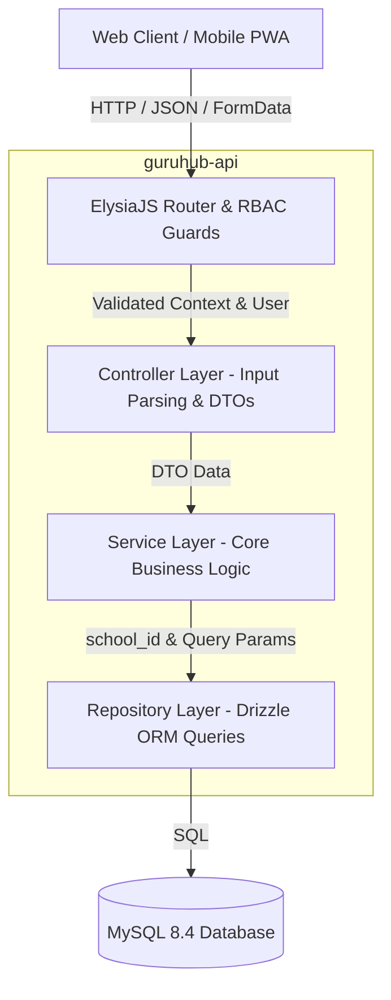
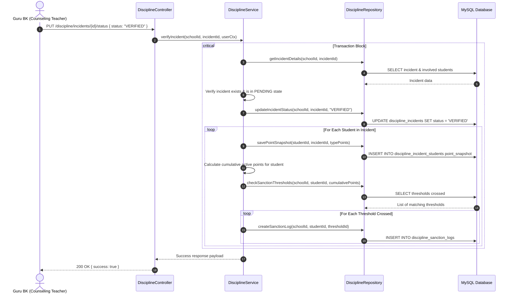
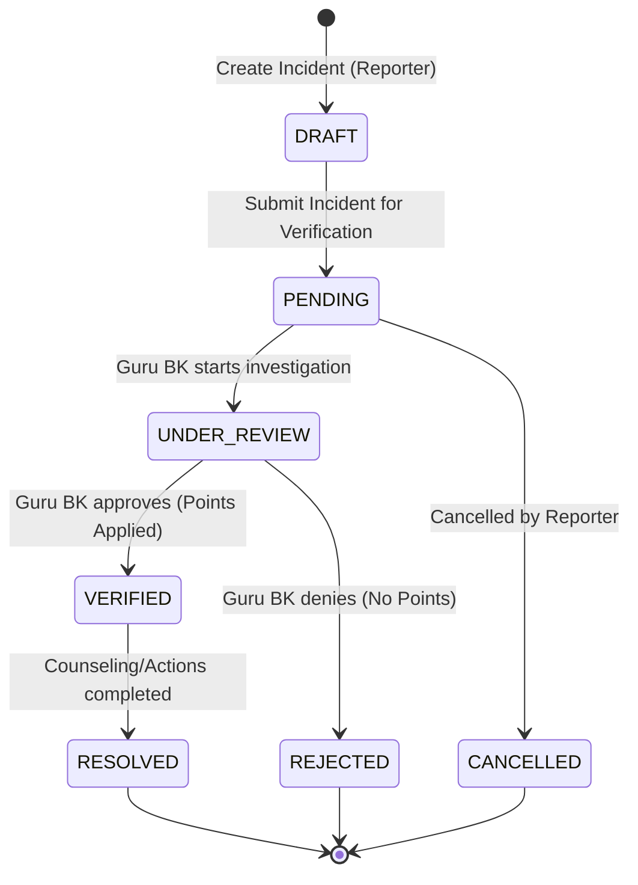
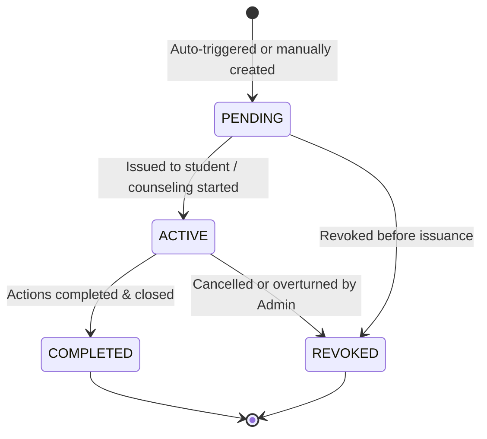

# 22 — Technical Design Document (TDD)

## Module Name: Student Character & Discipline Management
**Author:** Lead Software Architect  
**Status:** DRAFT (Sprint 0)  
**Date:** 2026-07-25  

---

## 1. System Overview

The Student Character & Discipline Management module is designed using a **Clean Architecture** approach. It isolates database operations, business logic, and transport protocols. It is designed to scale and support future capabilities like parent messaging and AI pattern analysis.

This module works across three workspaces:
1. **Backend API (`guruhub-api`)**: An ElysiaJS web server that runs on Bun. It uses Drizzle ORM to connect to a MySQL 8.4 database.
2. **Web Admin (`front-guruhub`)**: A Next.js web application for administrators and counseling teachers to configure settings, review incidents, and issue sanctions.
3. **Mobile PWA (`front-guruhub-mobile`)**: A Next.js progressive web application for teachers to report incidents and view dashboards.

---

## 2. Architecture & Data Flow Diagram



---

## 3. Module Responsibility Matrix

| Layer | Files / Path | Responsibilities |
|---|---|---|
| **Route Guard** | `src/modules/discipline/routes/` | Validate HTTP headers, parse JWT context, and enforce role-based access. |
| **Controller** | `src/modules/discipline/controller/` | Parse request parameters, validate payloads using TypeBox DTO schemas, and format HTTP responses. |
| **Service** | `src/modules/discipline/service/` | Coordinate transactions, check business rules, log audits, and trigger automated sanctions. |
| **Repository** | `src/modules/discipline/repository/` | Run optimized Drizzle ORM queries, enforcing soft-delete and tenant-isolation boundaries. |
| **Schema** | `src/schema/discipline.ts` | Define Drizzle ORM table models, indexes, constraints, and relationships. |

---

## 4. Key Workflows & Sequence Diagrams

### 4.1 Incident Verification & Point Accrual Flow
This diagram shows the sequence when a Counseling Teacher (Guru BK) verifies a pending incident report.



---

## 5. Entity State Machine Diagrams

### 5.1 Discipline Incident Status


### 5.2 Sanction Log Status


---

## 6. Directory Structure

This module follows the **GuruHub Coding Bible** modular organization guidelines:

```
guruhub-api/src/
├── schema/
│   └── discipline.ts             # All Drizzle ORM definitions for discipline
└── modules/
    └── discipline/
        ├── controller/
        │   └── disciplineController.ts    # Route handler controllers
        ├── dto/
        │   └── disciplineDto.ts           # TypeBox schema validation definitions
        ├── repository/
        │   └── disciplineRepository.ts    # Pure database queries using Drizzle
        ├── routes/
        │   └── disciplineRoutes.ts        # Route registration & RBAC configs
        └── service/
            └── disciplineService.ts       # Domain logic & transactions
```

---

## 7. Security Design

### 7.1 Multi-Tenant Isolation
Multi-tenant security is enforced at two layers matching the rest of the GuruHub project:
1. **Tenant Middleware (`src/middleware/tenant.ts`)**: Injects the `schoolId` extracted from the HTTP `x-school-id` header into the request context after validating the school exists in the database.
2. **Auth Middleware (`src/middleware/auth.ts`)**: Validates that the `schoolId` claims inside the JWT match the request context's `schoolId`. Mismatches return an HTTP `403 Forbidden` response.
3. **Repository Scope**: Every method in `DisciplineRepository` must take `schoolId` as its first parameter and append `eq(table.schoolId, schoolId)` to every SQL query.

### 7.2 Role-Based Access Control (RBAC)
We restrict operations based on the user's role:

| Endpoint Group | Allowed Roles | Business Constraint |
|---|---|---|
| **Settings / Policies** | `SuperAdmin`, `SchoolAdmin` | Global configuration controls. |
| **Threshold Setup** | `SuperAdmin`, `SchoolAdmin` | Setup rules for automatic sanctions. |
| **Incident Logging** | `SuperAdmin`, `SchoolAdmin`, `Principal`, `Teacher`, `HomeroomTeacher` | Any teacher can report violations or rewards. |
| **Incident Review** | `SuperAdmin`, `SchoolAdmin`, `Principal` | Only administrators can verify, reject, or resolve incident reports. |
| **Sanctions Logging** | `SuperAdmin`, `SchoolAdmin`, `Principal` | Only administrators can log sanction executions. |
| **Student Timelines** | `SuperAdmin`, `SchoolAdmin`, `Principal`, `HomeroomTeacher` | Access is restricted to administrators and homeroom teachers for students in their assigned classes. |

---

## 8. Performance Strategy

1. **Composite Indexes**: We add database indexes on foreign keys and frequently queried fields:
   - `discipline_incidents`: Index on `(school_id, status)` and `(school_id, incident_date)`.
   - `discipline_incident_students`: Index on `(student_id, academic_year_id)` to speed up student timeline queries.
   - `discipline_sanction_logs`: Index on `(school_id, student_id)`.
2. **Eager Loading Optimization**: Timeline queries run in two steps to avoid large SQL joins:
   - Query incident-student mappings for the target student ID.
   - Run batch select queries to load the parent incident details and associated attachments.
3. **Selective Count Aggregations**: We run lightweight count queries for dashboard metrics rather than loading full tables.
