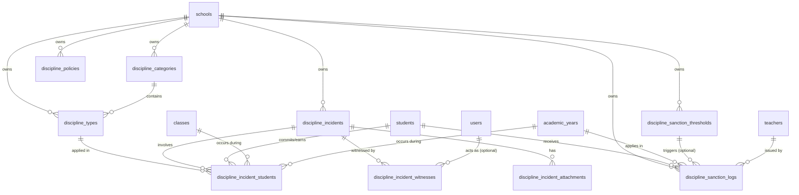

# 23 — Database Specification

## Module Name: Student Character & Discipline Management
**Author:** Lead Software Architect  
**Status:** DRAFT (Sprint 0)  
**Date:** 2026-07-25  

---

## 1. Entity-Relationship Diagram (ERD)

This diagram shows the relationship between the discipline tables and the main GuruHub administrative entities.



---

## 2. Table Specifications

### 2.1 `discipline_categories`
Stores the categorization groups for discipline events. Supports both violations and rewards.

| Column | Type | Nullable | Default | PK/FK | Constraints / Description |
|---|---|---|---|---|---|
| `id` | `BIGINT UNSIGNED` | No | | PK | Auto-incrementing primary key |
| `school_id` | `BIGINT UNSIGNED` | No | | FK | References `schools.id` ON DELETE CASCADE |
| `code` | `VARCHAR(30)` | No | | | Custom code, e.g., `CAT-PEL` or `CAT-PGR` |
| `name` | `VARCHAR(255)` | No | | | Category name in Indonesian |
| `type` | `ENUM('VIOLATION','REWARD')` | No | | | Hard distinction of category type |
| `description` | `TEXT` | Yes | | | Optional category details |
| `deleted_at` | `TIMESTAMP` | Yes | | | Timestamp for soft deletion |
| `created_at` | `TIMESTAMP` | Yes | `CURRENT_TIMESTAMP` | | Record creation timestamp |
| `updated_at` | `TIMESTAMP` | Yes | `CURRENT_TIMESTAMP` | | Automatically updates on row modification |

- **Indexes & Constraints**:
  - Unique Index: `uq_discipline_cat_code (school_id, code, deleted_at)`
  - Foreign Key constraint: `fk_cat_school (school_id) -> schools(id)`

---

### 2.2 `discipline_types`
Holds specific discipline types (rules or achievements) that belong to categories.

| Column | Type | Nullable | Default | PK/FK | Constraints / Description |
|---|---|---|---|---|---|
| `id` | `BIGINT UNSIGNED` | No | | PK | Auto-incrementing primary key |
| `school_id` | `BIGINT UNSIGNED` | No | | FK | References `schools.id` ON DELETE CASCADE |
| `category_id` | `BIGINT UNSIGNED` | No | | FK | References `discipline_categories.id` ON DELETE CASCADE |
| `code` | `VARCHAR(30)` | No | | | E.g. `PEL-01` (Terlambat) or `PGR-01` (Lomba) |
| `name` | `VARCHAR(255)` | No | | | Specific name in Indonesian |
| `default_points` | `INT` | No | `5` | | Point impact value applied |
| `description` | `TEXT` | Yes | | | Details of the rule or achievement |
| `deleted_at` | `TIMESTAMP` | Yes | | | Timestamp for soft deletion |
| `created_at` | `TIMESTAMP` | Yes | `CURRENT_TIMESTAMP` | | Record creation timestamp |
| `updated_at` | `TIMESTAMP` | Yes | `CURRENT_TIMESTAMP` | | Automatically updates on row modification |

- **Indexes & Constraints**:
  - Unique Index: `uq_discipline_type_code (school_id, code, deleted_at)`
  - Index: `idx_discipline_types_category (school_id, category_id)`
  - Foreign Key constraint: `fk_type_school (school_id) -> schools(id)`
  - Foreign Key constraint: `fk_type_category (category_id) -> discipline_categories(id)`

---

### 2.3 `discipline_policies`
Manages school-wide discipline policies, point reset cycle rules, and auto-sanction settings.

| Column | Type | Nullable | Default | PK/FK | Constraints / Description |
|---|---|---|---|---|---|
| `id` | `BIGINT UNSIGNED` | No | | PK | Auto-incrementing primary key |
| `school_id` | `BIGINT UNSIGNED` | No | | FK | References `schools.id` ON DELETE CASCADE |
| `point_reset_cycle` | `ENUM('ACADEMIC_YEAR', 'SEMESTER', 'NEVER')` | No | `'ACADEMIC_YEAR'` | | point reset frequency |
| `max_active_points` | `INT` | No | `100` | | Point threshold for extreme action |
| `auto_sanction_enabled` | `BOOLEAN` | No | `true` | | If true, auto-triggers sanction logs |
| `carry_forward_percentage` | `INT` | No | `0` | | Point percentage carried to next cycle |
| `created_at` | `TIMESTAMP` | Yes | `CURRENT_TIMESTAMP` | | Record creation timestamp |
| `updated_at` | `TIMESTAMP` | Yes | `CURRENT_TIMESTAMP` | | Automatically updates on row modification |

- **Indexes & Constraints**:
  - Unique Index: `uq_school_policy (school_id)`
  - Foreign Key constraint: `fk_policy_school (school_id) -> schools(id)`

---

### 2.4 `discipline_incidents`
Stores central incident data logged by reporters (teachers or school staff).

| Column | Type | Nullable | Default | PK/FK | Constraints / Description |
|---|---|---|---|---|---|
| `id` | `BIGINT UNSIGNED` | No | | PK | Auto-incrementing primary key |
| `school_id` | `BIGINT UNSIGNED` | No | | FK | References `schools.id` ON DELETE CASCADE |
| `reporter_user_id` | `BIGINT UNSIGNED` | No | | FK | References `users.id` ON DELETE CASCADE |
| `handler_teacher_id` | `BIGINT UNSIGNED` | Yes | | FK | References `teachers.id` ON DELETE SET NULL |
| `incident_date` | `DATE` | No | | | Date when the incident happened |
| `incident_time` | `TIME` | Yes | | | Time when the incident happened |
| `location` | `VARCHAR(255)` | Yes | | | Location name (e.g., "Kantin", "Lapangan") |
| `description` | `TEXT` | Yes | | | Narrative details of the incident |
| `status` | `ENUM('DRAFT', 'PENDING', 'UNDER_REVIEW', 'VERIFIED', 'REJECTED', 'CANCELLED', 'RESOLVED')` | No | `'DRAFT'` | | State machine workflow status |
| `deleted_at` | `TIMESTAMP` | Yes | | | Timestamp for soft deletion |
| `created_at` | `TIMESTAMP` | Yes | `CURRENT_TIMESTAMP` | | Record creation timestamp |
| `updated_at` | `TIMESTAMP` | Yes | `CURRENT_TIMESTAMP` | | Automatically updates on row modification |

- **Indexes & Constraints**:
  - Index: `idx_incidents_reporter (school_id, reporter_user_id)`
  - Index: `idx_incidents_handler (school_id, handler_teacher_id)`
  - Index: `idx_incidents_status (school_id, status)`
  - Index: `idx_incidents_date (school_id, incident_date)`
  - Foreign Key constraints:
    - `fk_inc_school (school_id) -> schools(id)`
    - `fk_inc_reporter (reporter_user_id) -> users(id)`
    - `fk_inc_handler (handler_teacher_id) -> teachers(id)`

---

### 2.5 `discipline_incident_students`
Links students, classes, academic years, and discipline types to incidents. Stores the point snapshot.

| Column | Type | Nullable | Default | PK/FK | Constraints / Description |
|---|---|---|---|---|---|
| `id` | `BIGINT UNSIGNED` | No | | PK | Auto-incrementing primary key |
| `incident_id` | `BIGINT UNSIGNED` | No | | FK | References `discipline_incidents.id` ON DELETE CASCADE |
| `student_id` | `BIGINT UNSIGNED` | No | | FK | References `students.id` ON DELETE CASCADE |
| `class_id` | `BIGINT UNSIGNED` | No | | FK | References `classes.id` ON DELETE CASCADE |
| `academic_year_id` | `BIGINT UNSIGNED` | No | | FK | References `academic_years.id` ON DELETE CASCADE |
| `discipline_type_id` | `BIGINT UNSIGNED` | No | | FK | References `discipline_types.id` ON DELETE CASCADE |
| `point_snapshot` | `INT` | No | | | Permanent point value copy |
| `notes` | `TEXT` | Yes | | | Student-specific notes |
| `created_at` | `TIMESTAMP` | Yes | `CURRENT_TIMESTAMP` | | Record creation timestamp |
| `updated_at` | `TIMESTAMP` | Yes | `CURRENT_TIMESTAMP` | | Automatically updates on row modification |

- **Indexes & Constraints**:
  - Index: `idx_inc_std_incident (incident_id)`
  - Index: `idx_inc_std_student (student_id, academic_year_id)`
  - Index: `idx_inc_std_class (class_id)`
  - Index: `idx_inc_std_type (discipline_type_id)`
  - Foreign Key constraints:
    - `fk_inc_std_incident (incident_id) -> discipline_incidents(id)`
    - `fk_inc_std_student (student_id) -> students(id)`
    - `fk_inc_std_class (class_id) -> classes(id)`
    - `fk_inc_std_year (academic_year_id) -> academic_years(id)`
    - `fk_inc_std_type (discipline_type_id) -> discipline_types(id)`

---

### 2.6 `discipline_incident_witnesses`
Stores optional witnesses associated with an incident report.

| Column | Type | Nullable | Default | PK/FK | Constraints / Description |
|---|---|---|---|---|---|
| `id` | `BIGINT UNSIGNED` | No | | PK | Auto-incrementing primary key |
| `incident_id` | `BIGINT UNSIGNED` | No | | FK | References `discipline_incidents.id` ON DELETE CASCADE |
| `user_id` | `BIGINT UNSIGNED` | Yes | | FK | References `users.id` ON DELETE SET NULL |
| `witness_name` | `VARCHAR(255)` | Yes | | | Name of witness (if external user) |
| `witness_role` | `ENUM('TEACHER','STUDENT','STAFF','OTHER')` | No | | | Witness role type |
| `notes` | `TEXT` | Yes | | | Additional notes on witness feedback |
| `created_at` | `TIMESTAMP` | Yes | `CURRENT_TIMESTAMP` | | Record creation timestamp |

- **Indexes & Constraints**:
  - Index: `idx_witness_incident (incident_id)`
  - Foreign Key constraints:
    - `fk_witness_incident (incident_id) -> discipline_incidents(id)`
    - `fk_witness_user (user_id) -> users(id)`

---

### 2.7 `discipline_incident_attachments`
Stores proof files (images, PDFs, videos) uploaded to support an incident report.

| Column | Type | Nullable | Default | PK/FK | Constraints / Description |
|---|---|---|---|---|---|
| `id` | `BIGINT UNSIGNED` | No | | PK | Auto-incrementing primary key |
| `incident_id` | `BIGINT UNSIGNED` | No | | FK | References `discipline_incidents.id` ON DELETE CASCADE |
| `file_url` | `VARCHAR(500)` | No | | | Storage path URL |
| `file_type` | `ENUM('IMAGE','PDF','VIDEO')` | No | | | File category type |
| `file_name` | `VARCHAR(255)` | Yes | | | Original upload file name |
| `file_size` | `INT` | Yes | | | Size in bytes |
| `created_at` | `TIMESTAMP` | Yes | `CURRENT_TIMESTAMP` | | Record creation timestamp |

- **Indexes & Constraints**:
  - Index: `idx_attachment_incident (incident_id)`
  - Foreign Key constraint: `fk_attach_incident (incident_id) -> discipline_incidents(id)`

---

### 2.8 `discipline_sanction_thresholds`
Defines rules for auto-triggering official sanctions based on a student's cumulative points.

| Column | Type | Nullable | Default | PK/FK | Constraints / Description |
|---|---|---|---|---|---|
| `id` | `BIGINT UNSIGNED` | No | | PK | Auto-incrementing primary key |
| `school_id` | `BIGINT UNSIGNED` | No | | FK | References `schools.id` ON DELETE CASCADE |
| `min_points` | `INT` | No | | | Cumulative points to trigger this threshold |
| `sanction_name` | `VARCHAR(255)` | No | | | Display name of the sanction |
| `action_required` | `ENUM(...)` | No | | | Required action (SP1, counseling, etc.) |
| `description` | `TEXT` | Yes | | | Action checklist description |
| `deleted_at` | `TIMESTAMP` | Yes | | | Timestamp for soft deletion |
| `created_at` | `TIMESTAMP` | Yes | `CURRENT_TIMESTAMP` | | Record creation timestamp |
| `updated_at` | `TIMESTAMP` | Yes | `CURRENT_TIMESTAMP` | | Automatically updates on row modification |

- **Indexes & Constraints**:
  - Index: `idx_thresholds_school (school_id, min_points)`
  - Foreign Key constraint: `fk_threshold_school (school_id) -> schools(id)`

---

### 2.9 `discipline_sanction_logs`
Logs triggered or manually issued sanctions for student behavior records.

| Column | Type | Nullable | Default | PK/FK | Constraints / Description |
|---|---|---|---|---|---|
| `id` | `BIGINT UNSIGNED` | No | | PK | Auto-incrementing primary key |
| `school_id` | `BIGINT UNSIGNED` | No | | FK | References `schools.id` ON DELETE CASCADE |
| `student_id` | `BIGINT UNSIGNED` | No | | FK | References `students.id` ON DELETE CASCADE |
| `academic_year_id` | `BIGINT UNSIGNED` | No | | FK | References `academic_years.id` ON DELETE CASCADE |
| `threshold_id` | `BIGINT UNSIGNED` | Yes | | FK | References `discipline_sanction_thresholds.id` ON DELETE SET NULL |
| `issued_by_teacher_id` | `BIGINT UNSIGNED` | No | | FK | References `teachers.id` ON DELETE CASCADE |
| `cumulative_points` | `INT` | No | | | Points snapshot when sanction triggered |
| `sanction_type` | `VARCHAR(100)` | No | | | Log type code |
| `document_url` | `VARCHAR(500)` | Yes | | | Scanned letter file URL upload |
| `notes` | `TEXT` | Yes | | | Follow up actions notes |
| `status` | `ENUM(...)` | No | `'PENDING'` | | Workflow status |
| `deleted_at` | `TIMESTAMP` | Yes | | | Timestamp for soft deletion |
| `created_at` | `TIMESTAMP` | Yes | `CURRENT_TIMESTAMP` | | Record creation timestamp |
| `updated_at` | `TIMESTAMP` | Yes | `CURRENT_TIMESTAMP` | | Automatically updates on row modification |

- **Indexes & Constraints**:
  - Index: `idx_sanctions_student (school_id, student_id, academic_year_id)`
  - Foreign Key constraints:
    - `fk_sanct_school (school_id) -> schools(id)`
    - `fk_sanct_student (student_id) -> students(id)`
    - `fk_sanct_year (academic_year_id) -> academic_years(id)`
    - `fk_sanct_threshold (threshold_id) -> discipline_sanction_thresholds(id)`
    - `fk_sanct_teacher (issued_by_teacher_id) -> teachers(id)`

---

## 3. Database Patterns & Strategies

### 3.1 Point Snapshots
When an incident is verified, the system copies the master point value from `discipline_types.default_points` and writes it directly to `discipline_incident_students.point_snapshot`. 
This copy guarantees that even if a school administrator modifies a category's default point value in the future, all historical student records and active points balance equations remain unchanged.

### 3.2 Soft-Delete Design
Tables that support soft deletion are configured with a `deleted_at` timestamp column. All active queries must filter out soft-deleted records:
```typescript
and(
  eq(table.schoolId, schoolId),
  isNull(table.deletedAt)
)
```

The child tables `discipline_incident_students`, `discipline_incident_witnesses`, and `discipline_incident_attachments` do not have a `deleted_at` column. They rely on cascade deletes (`ON DELETE CASCADE`) tied to their parent `discipline_incidents` record.

### 3.3 Audit Trail Fields
All primary tables contain `created_at` and `updated_at` timestamps. On row updates, the system uses MySQL's built-in behavior:
```sql
ON UPDATE CURRENT_TIMESTAMP
```
This ensures we have a reliable history of updates without relying on manual updates in the service layer.
