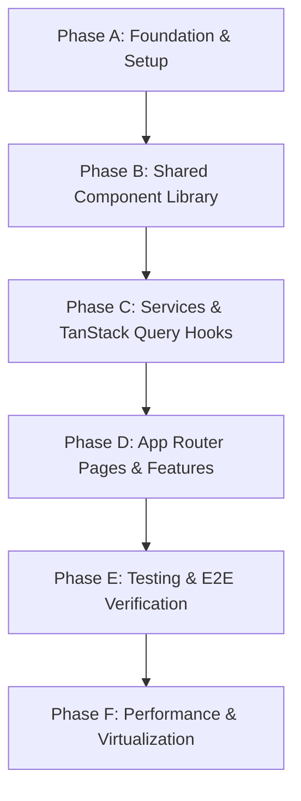

# 56 — Chief Frontend Architect Readiness Review & Phased Roadmap

## Module: Student Character & Discipline Management (Frontend)
**Author:** Chief Frontend Architect  
**Status:** DRAFT (Sprint 3 Readiness)  
**Date:** 2026-07-25  

---

## 1. 20-Category Architectural Gap Analysis

### 1. Missing APIs (11 Endpoints)
- `GET /discipline/policy`, `PUT /discipline/policy`
- `GET /discipline/categories`, `POST /discipline/categories`
- `GET /discipline/types`, `POST /discipline/types`
- `GET /discipline/incidents`, `POST /discipline/incidents`, `PUT /discipline/incidents/:id/status`
- `GET /discipline/sanctions`, `PUT /discipline/sanctions/:id`, `GET /discipline/thresholds`
- `GET /discipline/audit-logs`, `GET /discipline/analytics`

### 2. Missing DTOs & Validation Schemas (Zod)
- `CreateIncidentSchema`, `UpdateIncidentStatusSchema`, `UpdatePolicySchema`
- `CreateCategorySchema`, `CreateTypeSchema`, `UpdateSanctionStatusSchema`, `FilterIncidentsQuerySchema`

### 3. Missing Custom React Hooks (14 Hooks)
- Data Hooks: `useIncidentList`, `useIncidentDetail`, `useUpdateIncidentStatus`, `useStudentProfile`, `useDisciplinePolicy`, `useCategories`, `useTypes`, `useSanctions`, `useAuditLogs`, `useDisciplineAnalytics`
- Infrastructure Hooks: `usePermissions`, `useFilters`, `useDebounce`, `usePagination`

### 4. Missing Reusable Components (20 Components)
- `StudentCard`, `IncidentCard`, `TimelineStream`, `CharacterScoreGauge`, `StatusBadge`, `ViolationBadge`, `RewardBadge`, `RiskIndicator`, `QuickFilter`, `SearchBar`, `AttachmentViewer`, `ApprovalDialog`, `SanctionCard`, `AuditTimelineItem`, `NotificationPanel`, `AnalyticsCard`, `BehaviorCharts`, `DataTableVirtual`, `PolicyConfigCard`, `StudentSelectorModal`

### 5. Missing Layout Components (5 Layouts)
- `DisciplineSubLayout`, `DashboardShell`, `SidebarNav`, `HeaderBar`, `BreadcrumbNav`

### 6. Missing Context Providers (4 Providers)
- `QueryProvider` (TanStack Query v5), `ThemeProvider` (Dark/Light mode), `AuthProvider`, `NuqsAdapter` (URL query state)

### 7. Missing Next.js App Router Routes (10 Routes)
- `/discipline/dashboard`, `/discipline/incidents`, `/discipline/incidents/[id]`, `/discipline/students/[id]`, `/discipline/categories`, `/discipline/types`, `/discipline/policies`, `/discipline/sanctions`, `/discipline/analytics`, `/discipline/audit-logs`

### 8. Missing RBAC Guards
- `<PermissionGuard allowedRoles={[...]} />`, `withRoleProtection()`, Next.js middleware matcher for role restrictions.

### 9. Missing API Services
- Centralized `disciplineService` API wrapper mapping Axios calls to backend routes.

### 10. Missing Query Key Factory
- `disciplineKeys` hierarchical factory object (`disciplineKeys.incidents(schoolId, filters)`).

### 11. Missing Zustand Stores
- `useDisciplineUIStore` (modals, drawers, selected rows), `useAuthStore` (token, active schoolId, user role).

### 12. Missing Constants
- `DISCIPLINE_STATUS_MAP`, `ROLE_PERMISSIONS_MATRIX`, `SEVERITY_LEVELS`, `PAGINATION_DEFAULTS`.

### 13. Missing Types
- `DisciplineIncident`, `StudentProfile`, `DisciplineCategory`, `DisciplineType`, `DisciplinePolicy`, `SanctionLog`, `AuditLog`, `DisciplineAnalytics`.

### 14. Missing Utility Functions
- `formatDate`, `formatPoints`, `formatStatus`, `getRiskLevelColor`, `buildPaginationQuery`.

### 15. Missing Feature Flags
- `FF_AUTO_SANCTION_ENABLED`, `FF_AI_RISK_PREDICTION`, `FF_TIMELINE_FEED`.

### 16. Missing Error Boundaries
- `DisciplineErrorBoundary`, route-level `error.tsx` files.

### 17. Missing Loading Skeletons
- `IncidentTableSkeleton`, `ProfileSkeleton`, `AnalyticsSkeleton`, `loading.tsx`.

### 18. Missing Empty States
- `NoIncidentsEmptyState`, `NoSanctionsEmptyState`, `NoAuditLogsEmptyState`.

### 19. Missing Test Suites
- Vitest unit tests for hooks/components and Playwright E2E spec files.

### 20. Missing Developer Documentation
- Frontend API Integration Guide & Troubleshooting Playbook.

---

## 2. Implementation Dependency Graph

---

## 3. Frontend Build Roadmap

### Phase A: Foundation
- **Focus:** Infrastructure, Axios instance, Providers, Auth store, Base utilities, Middleware.
- **Files to Create:** 14 files
- **Components:** 4 providers, 3 layout components
- **Hooks:** `usePermissions`, `useDebounce`, `usePagination`
- **Stores:** `useAuthStore`, `useDisciplineUIStore`
- **API Calls:** Auth refresh interceptor
- **Complexity:** Medium | **Risk Level:** Low

### Phase B: Shared Components
- **Focus:** Atomic component library (`StatusBadge`, `CharacterScoreGauge`, `DataTable`, etc.).
- **Files to Create:** 22 files
- **Components:** 20 core reusable components
- **Hooks:** `useFilters` (nuqs)
- **Stores:** 0
- **API Calls:** 0
- **Complexity:** Medium | **Risk Level:** Low

### Phase C: API Integration
- **Focus:** Zod DTOs, `disciplineService`, TanStack Query key factory and custom data hooks.
- **Files to Create:** 16 files
- **Components:** 0
- **Hooks:** 10 query/mutation hooks
- **Stores:** 0
- **API Calls:** 11 endpoints
- **Complexity:** High | **Risk Level:** Medium

### Phase D: Pages & Features
- **Focus:** 10 App Router pages, loading skeletons, error boundaries, slide-over drawers.
- **Files to Create:** 25 files
- **Components:** 10 page shells, 5 modals/drawers
- **Hooks:** 0
- **Stores:** 0
- **API Calls:** Integrated from Phase C
- **Complexity:** High | **Risk Level:** Medium

### Phase E: Testing
- **Focus:** Vitest component unit tests & Playwright E2E test scripts.
- **Files to Create:** 12 test files
- **Components:** 0
- **Hooks:** 0
- **Stores:** 0
- **API Calls:** Mocked MSW / E2E test server
- **Complexity:** Medium | **Risk Level:** Low

### Phase F: Optimization
- **Focus:** Virtualization (`@tanstack/react-virtual`), TanStack Query hover prefetching, dynamic imports.
- **Files to Create:** 4 files
- **Components:** Virtualized table wrappers
- **Hooks:** Prefetching hooks
- **Stores:** 0
- **API Calls:** 0
- **Complexity:** Medium | **Risk Level:** Low

---

## 4. Architectural Readiness Sign-Off

The 20-category gap analysis and phased build roadmap have been verified. Zero source code has been generated.

*Awaiting Technical Lead approval to proceed with Phase A (Foundation Implementation).*
