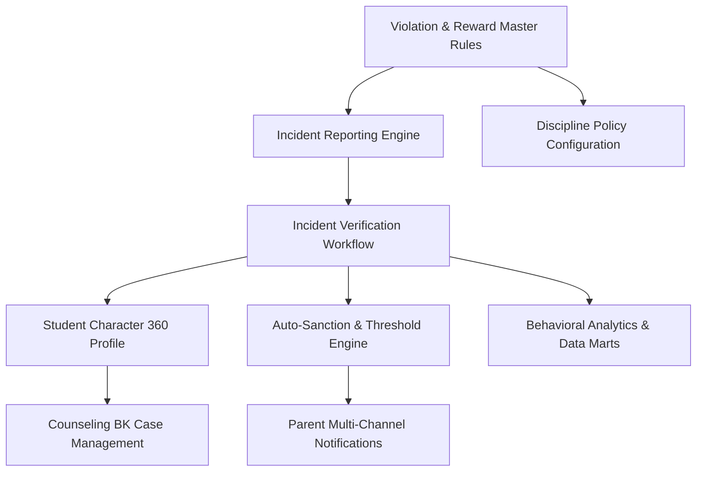

# 66 — Feature Review & Development Matrix

## Module: Student Character & Discipline Management
**Author:** Chief Product Architect  
**Status:** COMPLETE (Sprint 2.8)  
**Date:** 2026-07-25  

---

## 1. Feature Dependency Graph

---

## 2. Feature Complexity Matrix

| Feature Module | Business Logic | Data Density | Security Scope | UI Complexity | Overall Complexity |
| :--- | :---: | :---: | :---: | :---: | :---: |
| **Master Categories & Types** | Low | Low | Low | Medium | **Low (2/5)** |
| **Policy Setup & Settings** | Medium | Low | High | Medium | **Medium (3/5)** |
| **Incident Reporting & Attachments**| Medium | High | Medium | High | **Medium (3/5)** |
| **Incident Verification Workflow** | High | High | High | High | **High (4/5)** |
| **Student 360 Character Profile** | High | High | High | High | **High (4/5)** |
| **Counseling (BK) Case Management**| Medium | Medium | Critical | Medium | **High (4/5)** |
| **Auto-Sanction & Threshold Engine**| Critical | High | High | High | **Critical (5/5)** |
| **Behavioral Analytics & Heatmaps**| High | Critical | Medium | Critical | **Critical (5/5)** |

---

## 3. Development Priority Matrix & Estimated Story Points

| Priority Rank | Feature Name | Target Sprint | Estimated Story Points | Risk Level |
| :---: | :--- | :---: | :---: | :---: |
| **P1 (Must Have)** | Master Categories & Types Management | Sprint 3.1 | **5 SP** | Low |
| **P1 (Must Have)** | Incident Reporting & Verification Workflow | Sprint 3.2 | **13 SP** | Medium |
| **P1 (Must Have)** | Student 360 Character Profile Page | Sprint 3.3 | **8 SP** | Low |
| **P2 (Should Have)**| Auto-Sanction & Threshold Engine | Sprint 3.4 | **13 SP** | High |
| **P2 (Should Have)**| Counseling (BK) Case Management | Sprint 3.5 | **8 SP** | Medium |
| **P3 (Nice to Have)**| Behavioral Analytics & Executive BI | Sprint 3.6 | **13 SP** | Medium |
| **P3 (Nice to Have)**| Policy Configuration & Audit Log Viewer | Sprint 3.7 | **5 SP** | Low |

*Total Module Estimate:* **65 Story Points**

---

## 4. Risk Analysis & Mitigation Strategies

1. **Race Conditions in Demerit Point Accumulation:**  
   *Risk:* Rapid double-submissions of verified incidents causing incorrect point totals.  
   *Mitigation:* DB-level transaction locks (`DbTx`) and Redis idempotency keys during status mutations.

2. **Confidential Counseling Data Leakage:**  
   *Risk:* Unauthorized teachers viewing confidential counseling notes intended only for BK staff.  
   *Mitigation:* Strict API-level RBAC enforcement, excluding counseling notes from general student queries.

---

## 5. Architectural Sign-Off

The Functional Feature Specifications for all 9 discipline features are certified as **COMPLETE & ARCHITECTURALLY APPROVED**.

*Awaiting Technical Lead approval to begin source code implementation.*
