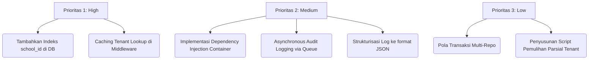

# Laporan Tinjauan Arsitektur (Architecture Review) GuruHub

Tinjauan arsitektur ini menganalisis rancangan sistem dan implementasi platform **GuruHub** saat ini guna menilai kesiapannya untuk melayani hingga **100.000 pengguna aktif** secara aman, stabil, dan dapat diskalakan (scalable).

---

## 1. Penilaian Kualitatif Arsitektur

### 1.1 Database Design & Indexing

* **Kondisi Saat Ini**:
  * Tabel terdefinisi secara modular dengan relasi integritas referensial (`onDelete: "cascade"`, dsb).
  * Kolom `school_id` tersemat di hampir seluruh tabel transaksional untuk isolasi multi-tenant.
* **Technical Debt & Bottleneck**:
  * **Kekurangan Indeks**: Sebagian besar tabel transaksional besar (seperti `attendances`, `schedules`, `assessments`, `journals`) tidak memiliki indeks pada kolom `school_id`. Pada database berukuran besar dengan 100.000+ pengguna, kueri harian sekolah akan memicu **Full Table Scan**, yang akan menurunkan performa database secara drastis.
  * **Composite Index**: Pencarian data spesifik (misal, mengambil rapor berdasarkan ID siswa di sekolah tertentu) memerlukan composite index `(school_id, student_id)`.

### 1.2 Clean Architecture & Dependency Injection

* **Kondisi Saat Ini**:
  * Pemisahan tanggung jawab (Separation of Concerns) sudah berjalan baik melalui lapisan Controller ➜ DTO ➜ Service ➜ Repository ➜ Database.
* **Technical Debt & Bottleneck**:
  * **Kopling Ketat Instansiasi (Tight Coupling)**: Instansiasi objek dilakukan secara hardcoded di dalam kelas (misal, `private repository = new AuthRepository()` di dalam `AuthService`). Hal ini melanggar **Dependency Inversion Principle (DIP)** dari SOLID. Komponen bergantung pada kelas konkret, bukan pada abstraksi (interface), sehingga mempersulit pembuatan Mock Test dan fleksibilitas perluasan di masa depan.

### 1.3 Repository & Transaction Management

* **Kondisi Saat Ini**:
  * `AuthRepository` mengabstraksi query dasar Drizzle dengan bersih.
* **Technical Debt & Bottleneck**:
  * **Manajemen Transaksi**: Belum ada pola untuk menjalankan transaksi database multi-repository di level Service tanpa mengekspos client transaksi ORM (`tx`) ke luar. Kebocoran detail infrastruktur ini merusak kemurnian Clean Architecture di Service Layer.

### 1.4 Service Layer

* **Kondisi Saat Ini**:
  * Orkestrasi autentikasi dan pembuatan token dilakukan dengan baik di `AuthService`.
* **Technical Debt & Bottleneck**:
  * **Audit Logging Sinkronus**: Penulisan log audit ke basis data MySQL dijalankan secara sinkronus di tengah alur login. Jika database sedang sibuk atau mengalami kendala sesaat, alur utama login akan terhambat dan gagal.

### 1.5 Middleware & Multi-Tenant Isolation

* **Kondisi Saat Ini**:
  * Middleware mendeteksi header `x-school-id` dan membandingkannya dengan payload JWT untuk memblokir akses lintas tenant.
* **Technical Debt & Bottleneck**:
  * **Overhead Database Per Request**: `tenantMiddleware` melakukan query `findSchoolById` ke MySQL pada **setiap single API request** untuk validasi sekolah. Jika ada 10.000 request masuk dalam waktu bersamaan, MySQL akan kewalahan memproses query validasi sekolah yang berulang.

### 1.6 Scalability (Hingga 100.000 Pengguna)

* **Kondisi Saat Ini**:
  * Platform dijalankan di atas runtime Bun yang memiliki I/O performa tinggi.
* **Technical Debt & Bottleneck**:
  * **Single Database Bottleneck**: Seluruh sekolah berbagi satu instance MySQL (Shared DB, Shared Schema). Tanpa Read Replicas dan connection pooling yang dioptimalkan, database akan menjadi titik kegagalan tunggal (Single Point of Failure).
  * **Ketiadaan Caching**: Tidak adanya Redis sebagai cache untuk sesi aktif (`sessions`) dan konfigurasi sekolah.

### 1.7 Backup Strategy

* **Kondisi Saat Ini**:
  * Pola Shared Database menyederhanakan backup seluruh sistem (cukup satu kali dump).
* **Technical Debt & Bottleneck**:
  * **Kesulitan Restore Parsial**: Sangat sulit memulihkan data untuk **satu sekolah tertentu** jika terjadi kerusakan data lokal, karena data 100+ sekolah tercampur dalam tabel yang sama.

### 1.8 Logging & Monitoring Strategy

* **Kondisi Saat Ini**:
  * Log audit transaksional disimpan di tabel `audit_logs`. Log aplikasi standar dikirim ke stdout menggunakan `console.log`.
* **Technical Debt & Bottleneck**:
  * **Unstructured Logs**: Log stdout tidak terstruktur (bukan berformat JSON), sehingga sulit dianalisis menggunakan tools agregator log (seperti ELK Stack, Loki, atau Datadog).
  * **Ketiadaan Monitoring APM**: Belum ada metrik visualisasi performa rute API, sisa memori/CPU runtime Bun, atau status connection pool database.

---

## 2. Rencana Tindakan & Prioritas Perbaikan

Berikut adalah prioritas pembenahan arsitektur demi menjamin skalabilitas 100.000 pengguna:

### Rekomendasi Solusi Cepat untuk Bottleneck Terbesar

1. **Indeks Database**:
   * Tambahkan indeks pada setiap kolom referensi `schoolId` di file skema Drizzle ORM:
     `bigint("school_id", { mode: "number", unsigned: true }).notNull().references(() => schools.id)`
     ditambahkan index di deklarasi model: `index("idx_school_id").on(table.schoolId)`.
2. **Caching Tenant**:
   * Gunakan Redis atau in-memory cache sederhana (misal, `Map` dengan TTL) untuk menyimpan daftar sekolah yang valid guna menghindari query basis data berulang pada tenant middleware.

---

## 3. Skor Arsitektur Keseluruhan

Berdasarkan analisis di atas, skor kesehatan arsitektur platform GuruHub saat ini dinilai sebesar:

### **78 / 100**

* **Kelebihan (Plus)**: Pemisahan layer yang bersih (Clean Architecture), penggunaan runtime modern (Bun), kesiapan model modular, isolasi tenant yang aman melalui middleware, serta manajemen session dengan token rotation.
* **Kekurangan (Minus)**: Tidak adanya indeks kolom tenant (`school_id`), query database berulang pada middleware (tenant lookup overhead), kopling ketat antarkomponen (tiada DI), dan logging audit yang masih bersifat sinkronus.
