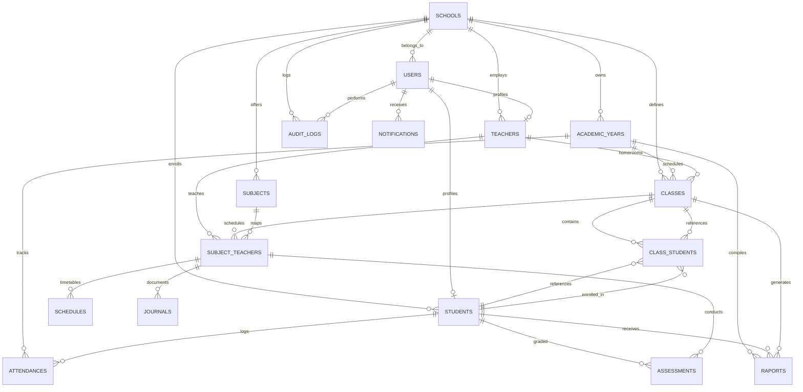

# Arsitektur Database GuruHub (Multi-Tenant)

Dokumen ini berisi spesifikasi arsitektur database untuk platform **GuruHub** (SaaS Administrasi Sekolah Indonesia berbasis Kurikulum Merdeka) menggunakan MySQL 8.4 dan Drizzle ORM.

## A. Entity Relationship Diagram (ERD)

Berikut adalah relasi antar tabel dengan format Mermaid:

---

## B. Detail Struktur Tabel

### 1. `schools` (Tenant Sekolah)
*   **Primary Key**: `id` (BIGINT, Auto Increment)
*   **Columns**:
    *   `id`: PK
    *   `npsn`: VARCHAR(8) (Unique, NPSN sekolah di Indonesia)
    *   `name`: VARCHAR(255) (Nama sekolah)
    *   `level`: ENUM('SMP', 'SMA') (Tingkat sekolah)
    *   `address`: TEXT
    *   `phone`: VARCHAR(20)
    *   `status`: ENUM('Negeri', 'Swasta')
    *   `created_at`: TIMESTAMP (Default Now)
    *   `updated_at`: TIMESTAMP (Default Now, On Update Now)
*   **Indexes**:
    *   `uq_schools_npsn`: UNIQUE(npsn)

### 2. `academic_years` (Tahun Akademik & Semester)
*   **Primary Key**: `id` (BIGINT, Auto Increment)
*   **Foreign Key**: `school_id` -> `schools(id)` ON DELETE CASCADE
*   **Columns**:
    *   `id`: PK
    *   `school_id`: FK
    *   `year`: VARCHAR(9) (Contoh: "2025/2026")
    *   `semester`: ENUM('Ganjil', 'Genap')
    *   `is_active`: BOOLEAN (Default False)
*   **Indexes**:
    *   `uq_school_academic_semester`: UNIQUE(school_id, year, semester) (Mencegah duplikasi data semester)

### 3. `users` (Pengguna & Hak Akses)
*   **Primary Key**: `id` (BIGINT, Auto Increment)
*   **Foreign Key**: `school_id` -> `schools(id)` ON DELETE CASCADE
*   **Columns**:
    *   `id`: PK
    *   `school_id`: FK
    *   `email`: VARCHAR(255)
    *   `password_hash`: VARCHAR(255)
    *   `role`: ENUM('SuperAdmin', 'AdminSekolah', 'Guru', 'Siswa', 'WaliSiswa')
    *   `status`: ENUM('Aktif', 'Nonaktif')
*   **Indexes**:
    *   `uq_school_email`: UNIQUE(school_id, email) (Satu email hanya boleh terdaftar sekali per sekolah)

### 4. `teachers` (Profil Guru)
*   **Primary Key**: `id` (BIGINT, Auto Increment)
*   **Foreign Keys**:
    *   `school_id` -> `schools(id)` ON DELETE CASCADE
    *   `user_id` -> `users(id)` ON DELETE SET NULL
*   **Columns**:
    *   `id`: PK
    *   `school_id`: FK
    *   `user_id`: FK (Nullable, jika guru belum login)
    *   `nip`: VARCHAR(18) (NIP guru, Nullable)
    *   `name`: VARCHAR(255)
    *   `phone`: VARCHAR(20)
    *   `gender`: ENUM('L', 'P')
*   **Indexes**:
    *   `uq_school_nip`: UNIQUE(school_id, nip) (NIP harus unik per sekolah jika ada)

### 5. `students` (Profil Siswa)
*   **Primary Key**: `id` (BIGINT, Auto Increment)
*   **Foreign Keys**:
    *   `school_id` -> `schools(id)` ON DELETE CASCADE
    *   `user_id` -> `users(id)` ON DELETE SET NULL
*   **Columns**:
    *   `id`: PK
    *   `school_id`: FK
    *   `user_id`: FK (Nullable)
    *   `nisn`: VARCHAR(10) (Unique Nasional)
    *   `nis`: VARCHAR(20) (NIS lokal sekolah)
    *   `name`: VARCHAR(255)
    *   `gender`: ENUM('L', 'P')
    *   `birth_place`: VARCHAR(100)
    *   `birth_date`: DATE
*   **Indexes**:
    *   `uq_students_nisn`: UNIQUE(nisn)
    *   `uq_school_nis`: UNIQUE(school_id, nis)

### 6. `classes` (Data Kelas)
*   **Primary Key**: `id` (BIGINT, Auto Increment)
*   **Foreign Keys**:
    *   `school_id` -> `schools(id)` ON DELETE CASCADE
    *   `academic_year_id` -> `academic_years(id)` ON DELETE CASCADE
    *   `homeroom_teacher_id` -> `teachers(id)` ON DELETE SET NULL
*   **Columns**:
    *   `id`: PK
    *   `school_id`: FK
    *   `academic_year_id`: FK
    *   `homeroom_teacher_id`: FK
    *   `name`: VARCHAR(50) (Contoh: "VII-A", "X-MIPA-1")
    *   `grade_level`: ENUM('7', '8', '9', '10', '11', '12')
*   **Indexes**:
    *   `uq_school_year_class_name`: UNIQUE(school_id, academic_year_id, name)

### 7. `class_students` (Pemetaan Siswa ke Kelas per Tahun Akademik)
*   **Primary Key**: `id` (BIGINT, Auto Increment)
*   **Foreign Keys**:
    *   `school_id` -> `schools(id)` ON DELETE CASCADE
    *   `class_id` -> `classes(id)` ON DELETE CASCADE
    *   `student_id` -> `students(id)` ON DELETE CASCADE
*   **Columns**:
    *   `id`: PK
    *   `school_id`: FK
    *   `class_id`: FK
    *   `student_id`: FK
*   **Indexes**:
    *   `uq_school_student_year_class`: UNIQUE(school_id, class_id, student_id) (Siswa hanya bisa berada di satu kelas per tahun akademik)

### 8. `subjects` (Mata Pelajaran)
*   **Primary Key**: `id` (BIGINT, Auto Increment)
*   **Foreign Key**: `school_id` -> `schools(id)` ON DELETE CASCADE
*   **Columns**:
    *   `id`: PK
    *   `school_id`: FK
    *   `name`: VARCHAR(100)
    *   `code`: VARCHAR(20) (Contoh: "IND-SMP7")
    *   `grade_level`: ENUM('7', '8', '9', '10', '11', '12')
*   **Indexes**:
    *   `uq_school_subject_code`: UNIQUE(school_id, code)

### 9. `subject_teachers` (Guru Pengampu Mapel di Kelas)
*   **Primary Key**: `id` (BIGINT, Auto Increment)
*   **Foreign Keys**:
    *   `school_id` -> `schools(id)` ON DELETE CASCADE
    *   `class_id` -> `classes(id)` ON DELETE CASCADE
    *   `subject_id` -> `subjects(id)` ON DELETE CASCADE
    *   `teacher_id` -> `teachers(id)` ON DELETE CASCADE
*   **Columns**:
    *   `id`: PK
    *   `school_id`: FK
    *   `class_id`: FK
    *   `subject_id`: FK
    *   `teacher_id`: FK
*   **Indexes**:
    *   `uq_school_class_subject`: UNIQUE(school_id, class_id, subject_id) (Satu mapel di suatu kelas hanya diampu satu guru)

### 10. `schedules` (Jadwal Pelajaran)
*   **Primary Key**: `id` (BIGINT, Auto Increment)
*   **Foreign Keys**:
    *   `school_id` -> `schools(id)` ON DELETE CASCADE
    *   `subject_teacher_id` -> `subject_teachers(id)` ON DELETE CASCADE
*   **Columns**:
    *   `id`: PK
    *   `school_id`: FK
    *   `subject_teacher_id`: FK
    *   `day`: ENUM('Senin', 'Selasa', 'Rabu', 'Kamis', 'Jumat', 'Sabtu')
    *   `start_time`: TIME
    *   `end_time`: TIME
    *   `room`: VARCHAR(50)

### 11. `attendances` (Absensi Harian Siswa)
*   **Primary Key**: `id` (BIGINT, Auto Increment)
*   **Foreign Keys**:
    *   `school_id` -> `schools(id)` ON DELETE CASCADE
    *   `student_id` -> `students(id)` ON DELETE CASCADE
    *   `academic_year_id` -> `academic_years(id)` ON DELETE CASCADE
    *   `marked_by_id` -> `users(id)` ON DELETE SET NULL
*   **Columns**:
    *   `id`: PK
    *   `school_id`: FK
    *   `student_id`: FK
    *   `academic_year_id`: FK
    *   `date`: DATE
    *   `status`: ENUM('Hadir', 'Sakit', 'Izin', 'Alfa')
    *   `note`: TEXT
    *   `marked_by_id`: FK
*   **Indexes**:
    *   `uq_school_student_date`: UNIQUE(school_id, student_id, date)

### 12. `journals` (Jurnal Mengajar Guru)
*   **Primary Key**: `id` (BIGINT, Auto Increment)
*   **Foreign Keys**:
    *   `school_id` -> `schools(id)` ON DELETE CASCADE
    *   `subject_teacher_id` -> `subject_teachers(id)` ON DELETE CASCADE
*   **Columns**:
    *   `id`: PK
    *   `school_id`: FK
    *   `subject_teacher_id`: FK
    *   `date`: DATE
    *   `topic`: VARCHAR(255)
    *   `activities`: TEXT
    *   `notes`: TEXT

### 13. `assessments` (Penilaian Formatif & Sumatif Kurikulum Merdeka)
*   **Primary Key**: `id` (BIGINT, Auto Increment)
*   **Foreign Keys**:
    *   `school_id` -> `schools(id)` ON DELETE CASCADE
    *   `student_id` -> `students(id)` ON DELETE CASCADE
    *   `subject_teacher_id` -> `subject_teachers(id)` ON DELETE CASCADE
*   **Columns**:
    *   `id`: PK
    *   `school_id`: FK
    *   `student_id`: FK
    *   `subject_teacher_id`: FK
    *   `type`: ENUM('Formatif', 'Sumatif_Harian', 'Sumatif_Tengah_Semester', 'Sumatif_Akhir_Semester')
    *   `name`: VARCHAR(100) (Contoh: "Sumatif Bab 1: Aljabar")
    *   `score`: DECIMAL(5,2) (Nilai 0 - 100)
    *   `feedback`: TEXT (Catatan capaian kompetensi siswa)

### 14. `raports` (Rapor Kurikulum Merdeka)
*   **Primary Key**: `id` (BIGINT, Auto Increment)
*   **Foreign Keys**:
    *   `school_id` -> `schools(id)` ON DELETE CASCADE
    *   `student_id` -> `students(id)` ON DELETE CASCADE
    *   `class_id` -> `classes(id)` ON DELETE CASCADE
    *   `academic_year_id` -> `academic_years(id)` ON DELETE CASCADE
*   **Columns**:
    *   `id`: PK
    *   `school_id`: FK
    *   `student_id`: FK
    *   `class_id`: FK
    *   `academic_year_id`: FK
    *   `notes`: TEXT (Catatan wali kelas)
    *   `extracurriculars`: JSON (Menyimpan nama ekskul, nilai, dan deskripsi)
    *   `attendance_sick`: INT (Default 0)
    *   `attendance_permission`: INT (Default 0)
    *   `attendance_absent`: INT (Default 0)
    *   `status`: ENUM('Draft', 'Published')
    *   `published_at`: TIMESTAMP
*   **Indexes**:
    *   `uq_school_student_academic_year`: UNIQUE(school_id, student_id, academic_year_id)

### 15. `notifications` (Notifikasi Sistem)
*   **Primary Key**: `id` (BIGINT, Auto Increment)
*   **Foreign Keys**:
    *   `school_id` -> `schools(id)` ON DELETE CASCADE
    *   `user_id` -> `users(id)` ON DELETE CASCADE
*   **Columns**:
    *   `id`: PK
    *   `school_id`: FK
    *   `user_id`: FK
    *   `title`: VARCHAR(150)
    *   `content`: TEXT
    *   `is_read`: BOOLEAN (Default False)

### 16. `audit_logs` (Audit Trail Aktivitas)
*   **Primary Key**: `id` (BIGINT, Auto Increment)
*   **Foreign Keys**:
    *   `school_id` -> `schools(id)` ON DELETE SET NULL
    *   `user_id` -> `users(id)` ON DELETE SET NULL
*   **Columns**:
    *   `id`: PK
    *   `school_id`: FK (Nullable)
    *   `user_id`: FK (Nullable)
    *   `action`: VARCHAR(100) (Contoh: "UPDATE_SCORE")
    *   `table_name`: VARCHAR(100)
    *   `record_id`: BIGINT (Nullable)
    *   `old_values`: JSON (Nullable)
    *   `new_values`: JSON (Nullable)
    *   `ip_address`: VARCHAR(45)

---

## C. Alasan Desain Database

1.  **Multi-Tenant Model (Shared Database, Shared Schema)**:
    *   Sangat hemat biaya dan mudah dikelola untuk SaaS skala menengah hingga besar.
    *   Setiap tabel (kecuali `schools` itu sendiri) memiliki kolom `school_id`. Dengan menyematkan `school_id` pada setiap query database transaksional, data antar sekolah terisolasi secara logis dengan aman.
2.  **Struktur Kurikulum Merdeka Terintegrasi**:
    *   Tabel `assessments` secara eksplisit membedakan asesmen **Formatif** (untuk memberikan feedback deskriptif) dan **Sumatif** (Harian, Tengah Semester, Akhir Semester) yang nantinya dikompilasi menjadi Nilai Rapor.
    *   Tabel `raports` memiliki kolom `extracurriculars` dengan tipe `JSON` agar fleksibel menampung data ekstrakurikuler dinamis yang diikuti siswa tanpa memerlukan skema tabel junction yang rumit.
3.  **Penggunaan Relasi Multi-Level**:
    *   `users` dipisahkan dari profil guru (`teachers`) dan siswa (`students`). Hal ini memfasilitasi kebutuhan skenario di mana profil guru atau siswa diinput terlebih dahulu oleh Admin Sekolah sebelum mereka membuat akun login (`user_id` bernilai `NULL` di awal).
4.  **Audit Trail Dinamis**:
    *   Tabel `audit_logs` merekam nilai sebelum (`old_values`) dan sesudah (`new_values`) modifikasi data dalam format JSON. Hal ini penting untuk audit kepatuhan (compliance) penilaian siswa oleh sekolah.

---

## E. Urutan Migrasi dan F. Rekomendasi Tabel

### Urutan Pembuatan (Migration Order)

Tabel harus dibuat berdasarkan urutan ketergantungan Foreign Key agar tidak memicu error constraint:

1.  `schools` (Induk utama)
2.  `academic_years` (Bergantung pada `schools`)
3.  `users` (Bergantung pada `schools`)
4.  `teachers` (Bergantung pada `schools`, `users`)
5.  `students` (Bergantung pada `schools`, `users`)
6.  `classes` (Bergantung pada `schools`, `academic_years`, `teachers`)
7.  `class_students` (Bergantung pada `schools`, `classes`, `students`)
8.  `subjects` (Bergantung pada `schools`)
9.  `subject_teachers` (Bergantung pada `schools`, `classes`, `subjects`, `teachers`)
10. `schedules` (Bergantung pada `schools`, `subject_teachers`)
11. `attendances` (Bergantung pada `schools`, `students`, `academic_years`, `users`)
12. `journals` (Bergantung pada `schools`, `subject_teachers`)
13. `assessments` (Bergantung pada `schools`, `students`, `subject_teachers`)
14. `raports` (Bergantung pada `schools`, `students`, `classes`, `academic_years`)
15. `notifications` (Bergantung pada `schools`, `users`)
16. `audit_logs` (Bergantung pada `schools`, `users`)
