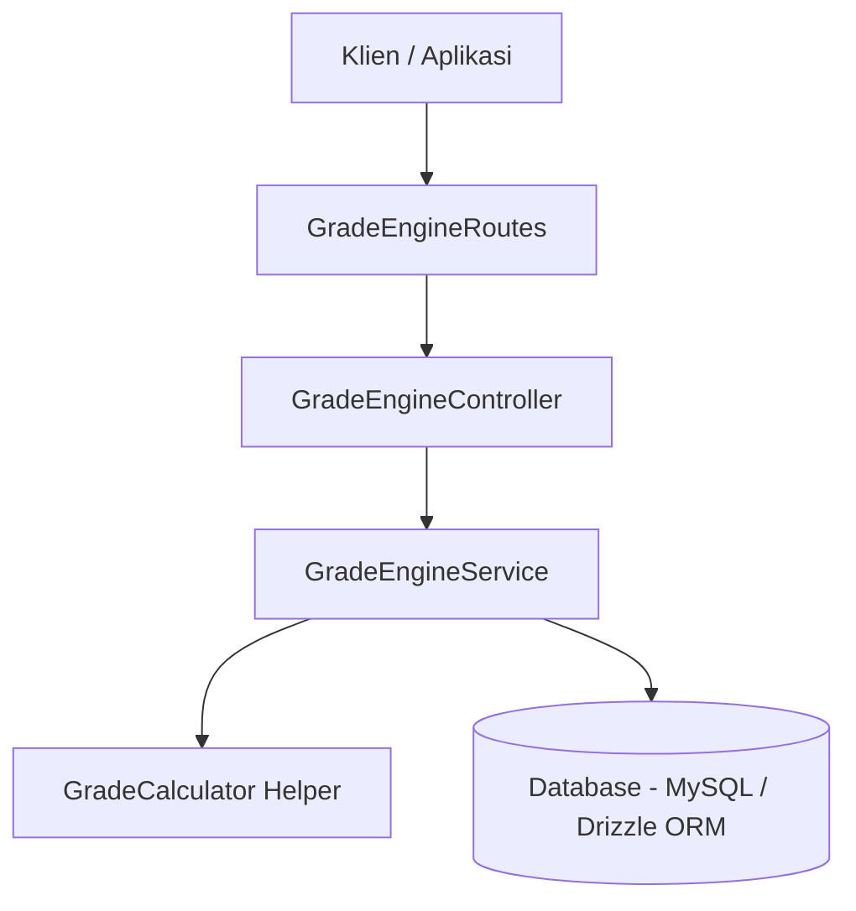

# Dokumentasi Modul Academic Grade Engine GuruHub

Academic Grade Engine adalah modul inti yang bertanggung jawab untuk melakukan kalkulasi nilai akhir siswa secara otomatis untuk mata pelajaran tertentu pada tahun ajaran aktif berdasarkan bobot kategori penilaian (*Assessment Categories*), asesmen (*Assessments*), dan nilai asesmen (*Assessment Scores*). Modul ini menjadi landasan utama bagi pelaporan Rapor Kurikulum Merdeka, perankingan kelas, analitik akademik, serta portal wali murid.

---

## 1. Arsitektur Modul

Modul ini dirancang menggunakan prinsip *Clean Architecture* dan *Multi-Tenant Isolation* dengan pemisahan tanggung jawab yang jelas:



*   **Database Schema (`src/schema/studentFinalGrades.ts`)**: Mendefinisikan tabel `student_final_grades` tempat menyimpan nilai akhir teragregasi.
*   **Service Layer (`src/modules/grade-engine/service/gradeEngineService.ts`)**: Berisi logika penarikan bobot kategori aktif, penghitungan rata-rata nilai, perkalian bobot, dan logika upsert data.
*   **Helper (`src/utils/gradeCalculator.ts`)**: Berisi fungsi deterministik untuk mengonversi angka nilai akhir menjadi huruf mutu (*Grade Letter*).
*   **Controller & Routes (`src/modules/grade-engine/controller/` & `routes/`)**: Mengatur mapping API, validasi skema input (DTO), serta verifikasi hak akses berbasis peran (RBAC).

---

## 2. Rumus Perhitungan Nilai Akhir

Nilai akhir mata pelajaran untuk seorang siswa dihitung secara tertimbang menggunakan formula berikut:

$$\text{Nilai Akhir} = \sum \left( \text{Rata-rata Nilai per Kategori} \times \frac{\text{Bobot Kategori}}{100} \right)$$

### Aturan Perhitungan:
1.  **Rata-rata Nilai per Kategori**:
    Untuk setiap kategori penilaian (misal: Tugas, Penilaian Harian, dll), rata-rata dihitung dari seluruh asesmen aktif (tidak di-soft-delete) yang termasuk dalam kategori tersebut.
    $$\text{Rata-rata Kategori} = \frac{\sum \text{Score Asesmen dalam Kategori}}{\text{Jumlah Asesmen dalam Kategori}}$$
2.  **Kategori Tanpa Asesmen**:
    Jika suatu kategori tidak memiliki asesmen sama sekali pada mata pelajaran tersebut, maka kontribusi dan bobot kategori tersebut dianggap **0** (tidak dihitung dalam total nilai akhir).
3.  **Nilai Kosong / Belum Diinput**:
    Jika terdapat asesmen di suatu kategori tetapi siswa belum memiliki baris nilai untuk asesmen tersebut, nilai siswa dianggap **0** untuk asesmen tersebut.
4.  **Pembulatan**:
    Hasil akhir dari penjumlahan kontribusi dibulatkan ke **dua angka di belakang koma**.

---

## 3. Contoh Perhitungan Manual

### Data Kategori & Bobot Sekolah A
*   Tugas: Bobot 20% (0.20)
*   Penilaian Harian (PH): Bobot 30% (0.30)
*   Proyek: Bobot 20% (0.20)
*   PTS: Bobot 15% (0.15)
*   PAS: Bobot 15% (0.15)

### Data Nilai Siswa Budi
1.  **Kategori Tugas**:
    *   Tugas 1 = 80
    *   Tugas 2 = 90
    *   *Rata-rata Kategori Tugas* = $(80 + 90) / 2 = 85$
    *   *Kontribusi Tugas* = $85 \times 20\% = 17.0$

2.  **Kategori PH**:
    *   PH 1 = 75
    *   PH 2 = 85
    *   PH 3 = 95
    *   *Rata-rata Kategori PH* = $(75 + 85 + 95) / 3 = 85$
    *   *Kontribusi PH* = $85 \times 30\% = 25.5$

3.  **Kategori Proyek**:
    *   Proyek 1 = 88
    *   *Rata-rata Kategori Proyek* = $88 / 1 = 88$
    *   *Kontribusi Proyek* = $88 \times 20\% = 17.6$

4.  **Kategori PTS**:
    *   PTS 1 = 90
    *   *Rata-rata Kategori PTS* = $90 / 1 = 90$
    *   *Kontribusi PTS* = $90 \times 15\% = 13.5$

5.  **Kategori PAS**:
    *   PAS 1 = 95
    *   *Rata-rata Kategori PAS* = $95 / 1 = 95$
    *   *Kontribusi PAS* = $95 \times 15\% = 14.25$

### Hasil Akhir
*   **Skor Akhir**: $17.0 + 25.5 + 17.6 + 13.5 + 14.25 = 87.85$
*   **Grade Letter**: **B** (sesuai aturan Grade Letter: $80 - 89.99 = \text{B}$)

---

## 4. Konversi Huruf Mutu (Grade Letter Rules)

Konversi nilai akhir (skala 0 - 100) menjadi huruf mutu didefinisikan sebagai berikut:

| Rentang Nilai | Huruf Mutu (Grade Letter) |
| :--- | :---: |
| $90.00 - 100.00$ | **A** |
| $80.00 - 89.99$ | **B** |
| $70.00 - 79.99$ | **C** |
| $< 70.00$ | **D** |

---

## 5. Spesifikasi API Endpoint

Setiap request wajib menyertakan header:
*   `x-school-id`: ID Sekolah (Tenant)
*   `Authorization`: `Bearer <accessToken>`

### 1. POST /grade-engine/calculate (Hitung Nilai Akhir Satu Siswa)
Melakukan kalkulasi nilai akhir dan menyimpannya (atau memperbarui jika sudah ada) ke tabel `student_final_grades`.
*   **Akses Peran**: SuperAdmin, SchoolAdmin, Principal, Teacher.
*   **Request Body (JSON)**:
    ```json
    {
      "studentId": 1,
      "subjectId": 2,
      "academicYearId": 1
    }
    ```
*   **Response Sukses (200 OK)**:
    ```json
    {
      "success": true,
      "message": "Perhitungan nilai akhir siswa berhasil",
      "data": {
        "finalScore": 87.85,
        "gradeLetter": "B"
      }
    }
    ```

---

### 2. POST /grade-engine/calculate-class (Hitung Nilai Satu Kelas)
Melakukan kalkulasi untuk seluruh siswa yang berstatus `ACTIVE` dalam suatu kelas.
*   **Akses Peran**: SuperAdmin, SchoolAdmin, Principal, Teacher.
*   **Request Body (JSON)**:
    ```json
    {
      "classId": 1,
      "subjectId": 2,
      "academicYearId": 1
    }
    ```
*   **Response Sukses (200 OK)**:
    ```json
    {
      "success": true,
      "message": "Perhitungan nilai akhir seluruh siswa di kelas berhasil",
      "data": [
        {
          "studentId": 1,
          "finalScore": 87.85,
          "gradeLetter": "B"
        },
        {
          "studentId": 2,
          "finalScore": 95.00,
          "gradeLetter": "A"
        }
      ]
    }
    ```

---

### 3. GET /grade-engine/student/:studentId (Ambil Nilai Akhir Terhitung)
Mendapatkan hasil perhitungan terakhir yang tersimpan di database.
*   **Akses Peran**: SuperAdmin, SchoolAdmin, Principal, Teacher, HomeroomTeacher.
*   **Query Params**:
    *   `subjectId` (number, wajib)
    *   `academicYearId` (number, wajib)
*   **Contoh Request**:
    `GET /grade-engine/student/1?subjectId=2&academicYearId=1`
*   **Response Sukses (200 OK)**:
    ```json
    {
      "success": true,
      "message": "Data nilai akhir siswa berhasil diambil",
      "data": {
        "id": 1,
        "schoolId": 1,
        "studentId": 1,
        "classId": 1,
        "subjectId": 2,
        "academicYearId": 1,
        "finalScore": 87.85,
        "gradeLetter": "B",
        "calculatedAt": "2026-06-16T14:15:00.000Z",
        "createdAt": "2026-06-16T14:15:00.000Z",
        "updatedAt": "2026-06-16T14:15:00.000Z"
      }
    }
    ```

---

## 6. Pengujian & Validasi

Anda dapat menjalankan seluruh pengujian otomatis khusus untuk modul ini dengan mengeksekusi runner pengujian:

```bash
bun test tests/grade-engine.test.ts
```

Uji otomatis mencakup 20 skenario pengujian integral termasuk:
1.  Verifikasi keakuratan kalkulasi nilai tertimbang sesuai bobot kategori.
2.  Konversi huruf mutu (A, B, C, D) berdasarkan rentang nilai.
3.  Eksklusi asesmen yang telah di-soft-delete.
4.  Penolakan kalkulasi siswa berstatus non-aktif (`INACTIVE`).
5.  Pembatasan akses peran (RBAC) dan perlindungan data multi-sekolah (*Tenant Isolation*).
6.  Operasi Upsert (buat/perbarui data nilai akhir).
