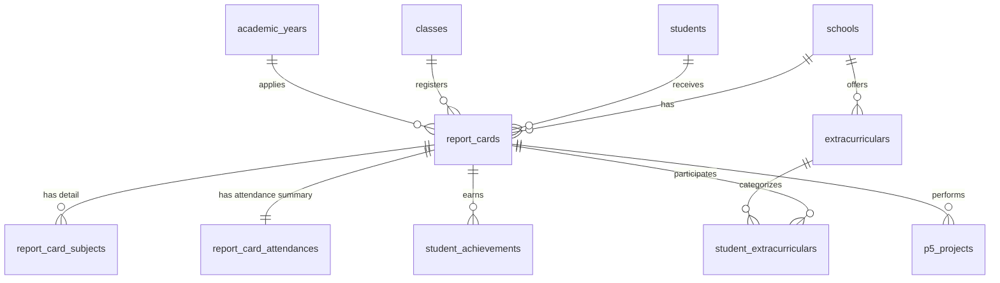
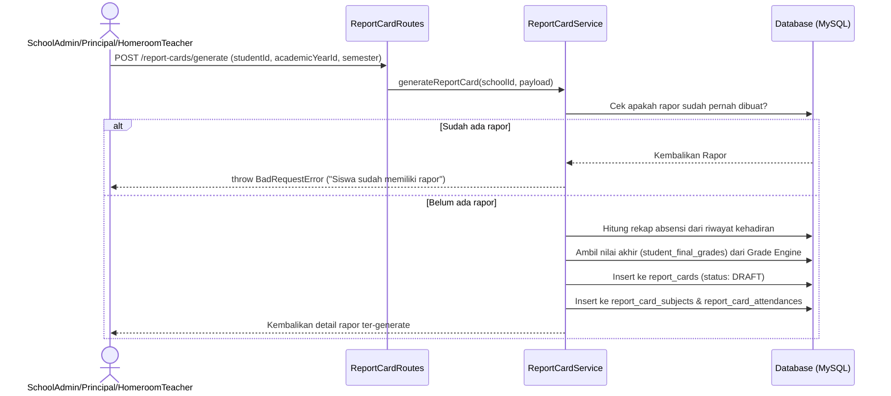

# Dokumentasi Modul Rapor (Kurikulum Merdeka) GuruHub

Modul ini bertanggung jawab untuk menghasilkan Rapor Kurikulum Merdeka bagi siswa berdasarkan agregasi nilai akhir (dari Grade Engine), kehadiran siswa, catatan wali kelas, kegiatan ekstrakurikuler, prestasi, serta penilaian projek P5. Modul ini mendukung sekolah tingkat SMP dan SMA dengan isolasi multi-tenant yang aman.

---

## 1. Entity Relationship Diagram (ERD)



### Penjelasan Tabel:
1.  **`report_cards`**: Menyimpan entitas utama rapor siswa per semester dan tahun ajaran.
2.  **`report_card_subjects`**: Menyimpan detail nilai akhir per mata pelajaran yang diambil otomatis dari Grade Engine, lengkap dengan huruf mutu dan deskripsi capaian pembelajaran otomatis.
3.  **`report_card_attendances`**: Menyimpan rangkuman kehadiran siswa (sakit, izin, tanpa keterangan) dalam semester bersangkutan.
4.  **`extracurriculars`**: Tabel master kegiatan ekstrakurikuler sekolah.
5.  **`student_extracurriculars`**: Menyimpan predikat (A, B, C, D) dan keterangan capaian ekstrakurikuler siswa.
6.  **`student_achievements`**: Menyimpan data prestasi akademik maupun non-akademik siswa.
7.  **`p5_projects`**: Menyimpan nilai capaian projek Penguatan Profil Pelajar Pancasila (P5) siswa dengan predikat (SB, B, C, PB).

---

## 2. Business Rules (Aturan Bisnis)

1.  **Sumber Nilai**: Nilai mata pelajaran tidak boleh diinput manual pada rapor. Nilai harus ditarik secara otomatis dari tabel `student_final_grades` (hasil pengolahan Grade Engine).
2.  **Rangkuman Absensi**: Angka sakit, izin, dan tanpa keterangan dihitung secara otomatis berdasarkan riwayat detail kehadiran siswa pada tahun ajaran/semester yang aktif.
3.  **Keunikan Rapor**: Satu siswa hanya diperbolehkan memiliki maksimal **1 rapor per semester** di **1 tahun ajaran**.
4.  **Penguncian Data (Status PUBLISHED)**:
    *   Rapor yang baru dibuat berstatus `DRAFT`.
    *   Setelah berstatus `PUBLISHED`, seluruh data rapor (termasuk nilai mata pelajaran, catatan wali kelas, prestasi, ekstrakurikuler, P5) akan **terkunci dan tidak dapat diubah**.
    *   Penguncian ini hanya dapat dilewati (*bypass*) oleh akun bersumber peran **SuperAdmin**.
5.  **Master Ekstrakurikuler**: Siswa hanya bisa ditambahkan ke kegiatan ekstrakurikuler yang terdaftar di sekolah yang sama (Tenant Isolation).

---

## 3. Flow Generate Rapor (Alur Kerja)



---

## 4. Dokumentasi API Reference

Semua request memerlukan header:
*   `x-school-id`: ID Sekolah (Tenant)
*   `Authorization`: `Bearer <accessToken>`

### 1. POST `/report-cards/generate`
Membuat draf rapor baru.
*   **Hak Akses**: `SuperAdmin`, `SchoolAdmin`, `Principal`, `HomeroomTeacher`.
*   **Request Body**:
    ```json
    {
      "studentId": 1,
      "academicYearId": 1,
      "semester": "GANJIL"
    }
    ```

### 2. POST `/report-cards/:id/publish`
Mengubah status rapor menjadi `PUBLISHED`.
*   **Hak Akses**: `SuperAdmin`, `SchoolAdmin`, `Principal`.

### 3. PUT `/report-cards/:id/notes`
Memperbarui catatan wali kelas.
*   **Hak Akses**: `SuperAdmin`, `SchoolAdmin`, `Principal`, `HomeroomTeacher`.
*   **Request Body**:
    ```json
    {
      "notes": "Pertahankan prestasi belajarmu, Budi!"
    }
    ```

### 4. POST `/report-cards/:id/achievement`
Menambahkan prestasi baru ke rapor.
*   **Hak Akses**: `SuperAdmin`, `SchoolAdmin`, `Principal`, `HomeroomTeacher`.
*   **Request Body**:
    ```json
    {
      "title": "Juara 1 Lomba Catur Nasional",
      "level": "NATIONAL",
      "description": "Juara tingkat nasional diselenggarakan oleh PB Percasi"
    }
    ```

### 5. POST `/report-cards/:id/extracurricular`
Menambahkan ekstrakurikuler ke rapor.
*   **Hak Akses**: `SuperAdmin`, `SchoolAdmin`, `Principal`, `HomeroomTeacher`.
*   **Request Body**:
    ```json
    {
      "extracurricularId": 1,
      "predicate": "A",
      "description": "Sangat aktif memimpin regu pramuka"
    }
    ```

### 6. POST `/report-cards/:id/p5`
Menambahkan projek P5 ke rapor.
*   **Hak Akses**: `SuperAdmin`, `SchoolAdmin`, `Principal`, `HomeroomTeacher`.
*   **Request Body**:
    ```json
    {
      "theme": "Kewirausahaan",
      "predicate": "SB",
      "description": "Sangat berkembang dalam merancang rencana bisnis kuliner tradisional"
    }
    ```

### 7. GET `/report-cards/:id`
Mendapatkan detail rapor lengkap beserta semua sub-entitas relasinya.
*   **Hak Akses**: `SuperAdmin`, `SchoolAdmin`, `Principal`, `Teacher`, `HomeroomTeacher`.

### 8. DELETE `/report-cards/:id`
Menghapus rapor secara soft delete.
*   **Hak Akses**: `SuperAdmin`, `SchoolAdmin`, `Principal`, `HomeroomTeacher`.

---

## 5. Sample Response JSON (GET `/report-cards/:id`)

```json
{
  "success": true,
  "message": "Detail rapor berhasil diambil",
  "data": {
    "id": 1,
    "schoolId": 1,
    "studentId": 1,
    "classId": 1,
    "academicYearId": 1,
    "semester": "GANJIL",
    "status": "PUBLISHED",
    "homeroomTeacherNotes": "Pertahankan prestasi belajarmu, Budi!",
    "createdAt": "2026-06-16T14:20:00.000Z",
    "updatedAt": "2026-06-16T14:20:10.000Z",
    "deletedAt": null,
    "subjects": [
      {
        "id": 1,
        "reportCardId": 1,
        "subjectId": 1,
        "finalScore": 85,
        "gradeLetter": "B",
        "knowledgeDescription": "Baik dalam memahami materi pembelajaran."
      }
    ],
    "attendance": {
      "id": 1,
      "reportCardId": 1,
      "sick": 2,
      "permission": 1,
      "absent": 1
    },
    "extracurriculars": [
      {
        "id": 1,
        "extracurricularId": 1,
        "name": "Pramuka",
        "predicate": "A",
        "description": "Sangat aktif memimpin regu pramuka"
      }
    ],
    "achievements": [
      {
        "id": 1,
        "reportCardId": 1,
        "title": "Juara 1 Lomba Catur Nasional",
        "level": "NATIONAL",
        "description": "Juara tingkat nasional diselenggarakan oleh PB Percasi"
      }
    ],
    "p5Projects": [
      {
        "id": 1,
        "reportCardId": 1,
        "theme": "Kewirausahaan",
        "predicate": "SB",
        "description": "Sangat berkembang dalam merancang rencana bisnis kuliner tradisional"
      }
    ]
  }
}
```

---

## 6. Testing Guide (Panduan Pengujian)

Untuk memvalidasi kebenaran implementasi modul, jalankan perintah uji coba otomatis berikut:

```bash
bun test tests/report-cards.test.ts
```

Uji coba ini menguji 25 skenario bisnis, mencakup:
1.  Keberhasilan pembentukan data rapor (generate).
2.  Penolakan pembuatan rapor duplikat per semester/tahun ajaran.
3.  Pembatasan pembaruan data ketika rapor berstatus `PUBLISHED` (terkunci).
4.  Bypass penguncian rapor oleh akun `SuperAdmin`.
5.  Penerapan isolasi data antar sekolah (Tenant Isolation).
6.  Pemeriksaan hak akses peran (RBAC) bagi Guru, Siswa, Kepala Sekolah, dan Admin.
7.  Uji keterhubungan data dengan modul Grade Engine dan modul Absensi.
8.  Siklus hidup penghapusan logis (*soft delete lifecycle*).
